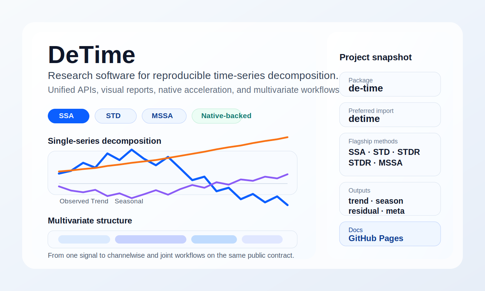

# De-Time

Workflow-oriented research software for reproducible time-series decomposition.

[](LICENSE)

[](https://systems-mechanobiology.github.io/De-Time/)




De-Time provides one stable software surface for decomposition workflows that
would otherwise be split across notebooks, method-specific wrappers, and
one-off scripts. The product name is **De-Time**, the distribution is
`de-time`, the canonical import is `detime`, and the legacy top-level
`tsdecomp` import and CLI remain available for one deprecation cycle.

Release `0.1.0` was cut on April 8, 2026 as tag `de-time-v0.1.0`. The latest
documented coverage snapshot for the gated core-plus-flagship surface is
`93.20%`.

## Scope

De-Time is for:

- one `decompose()` entrypoint,
- one `DecompositionConfig` model for Python and CLI usage,
- one `DecompResult` contract for `trend`, `season`, `residual`, `components`,
  and `meta`,
- native acceleration where it materially improves throughput,
- multivariate decomposition workflows where shared structure matters,
- machine-facing workflows that need schemas, recommendations, and low-token
  result views.

De-Time is not:

- a new decomposition algorithm,
- a benchmark leaderboard package,
- a replacement for every specialized upstream library,
- a claim that every bundled wrapper has equal maturity.

## Flagship methods

The main package is centered on four methods:

- `SSA`
- `STD`
- `STDR`
- `MSSA`

Other retained methods are wrappers or optional-backend integrations such as
`STL`, `MSTL`, `EMD`, `CEEMDAN`, `VMD`, `WAVELET`, `MVMD`, `MEMD`, and
`GABOR_CLUSTER`.

Benchmark-derived methods `DR_TS_REG`, `DR_TS_AE`, and `SL_LIB` do not ship in
the main package. They belong to the companion benchmark repository
[`systems-mechanobiology/de-time-bench`](https://github.com/systems-mechanobiology/de-time-bench).

## Install

```bash
pip install de-time
```

Optional multivariate backend extras:

```bash
pip install "de-time[multivar]"
```

Do not install the unrelated `detime` package from PyPI when you want this
project.

## Quickstart

```python
import numpy as np

from detime import DecompositionConfig, decompose

t = np.arange(120, dtype=float)
series = 0.03 * t + np.sin(2.0 * np.pi * t / 12.0)

result = decompose(
    series,
    DecompositionConfig(
        method="SSA",
        params={"window": 24, "rank": 6, "primary_period": 12},
    ),
)

print(result.trend.shape)
print(result.meta["backend_used"])
```

```bash
detime run \
  --method STD \
  --series examples/data/example_series.csv \
  --col value \
  --param period=12 \
  --out_dir out/std_run \
  --output-mode summary
```

## CLI surface

The supported commands are:

- `detime run`
- `detime batch`
- `detime profile`
- `detime version`
- `detime schema`
- `detime recommend`

The legacy `tsdecomp` executable calls the same code path but emits a
deprecation notice.

## Agent-native surface

De-Time now includes:

- packaged JSON schemas for `config`, `result`, `meta`, and `method-registry`,
- low-token result export modes: `full`, `summary`, and `meta`,
- machine-readable method metadata for registry, docs, and recommendation,
- `detime schema` and `detime recommend`,
- a minimal MCP server at `python -m detime.mcp.server`.

## Package boundary

This repository ships the reusable decomposition software package, docs, tests,
and examples needed for `detime` itself. Benchmark orchestration, leaderboard
artifacts, benchmark scenario galleries, and benchmark-derived methods are
split into the companion repository
[`systems-mechanobiology/de-time-bench`](https://github.com/systems-mechanobiology/de-time-bench).

Only the top-level `tsdecomp` import and CLI alias remain packaged for
compatibility.

## Quality and evidence

- Release smoke checks live in `scripts/release_smoke_matrix.py`.
- Reviewer-facing documentation consistency checks live in
  `scripts/check_doc_consistency.py`.
- The current performance snapshot is generated by
  `scripts/generate_performance_snapshot.py` and stored under
  `docs/assets/generated/evidence/`.
- The coverage gate applies to the canonical `detime` core-plus-flagship
  surface; CLI, I/O, visualization helpers, and optional wrappers remain
  tested but are outside the gated coverage denominator.

## Documentation

- Homepage: <https://systems-mechanobiology.github.io/De-Time/>
- Quickstart: <https://systems-mechanobiology.github.io/De-Time/quickstart/>
- ML workflows: <https://systems-mechanobiology.github.io/De-Time/ml-workflows/>
- Methods: <https://systems-mechanobiology.github.io/De-Time/methods/>
- API: <https://systems-mechanobiology.github.io/De-Time/api/>
- Migration guide: <https://systems-mechanobiology.github.io/De-Time/migration/>

## Project files

- Citation metadata: [`CITATION.cff`](CITATION.cff)
- Changelog: [`CHANGELOG.md`](CHANGELOG.md)
- Contributing guide: [`CONTRIBUTING.md`](CONTRIBUTING.md)
- Security policy: [`SECURITY.md`](SECURITY.md)
- Publishing notes: [`PUBLISHING.md`](PUBLISHING.md)
