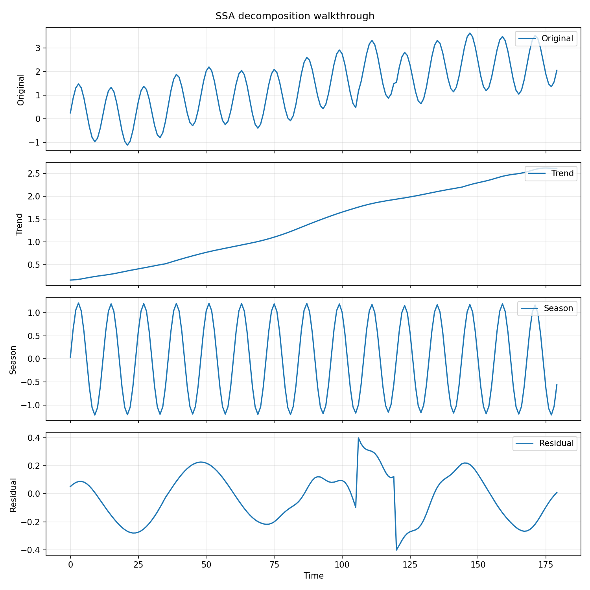
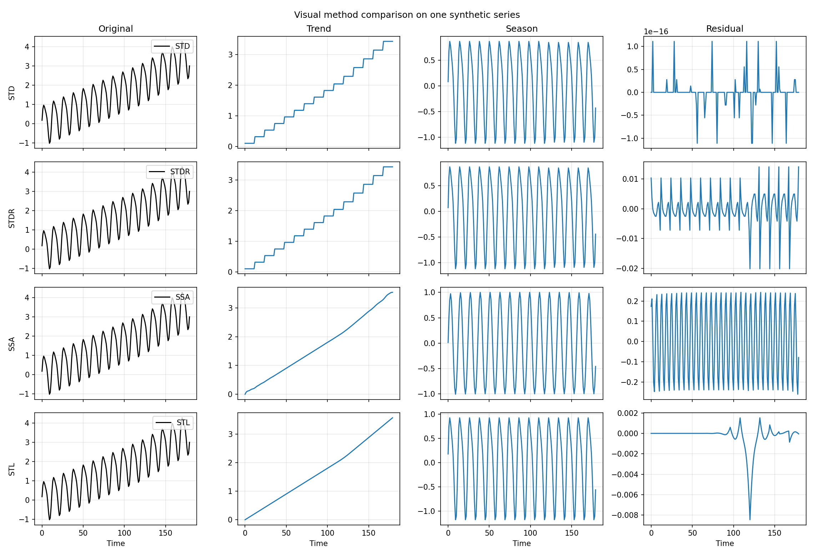
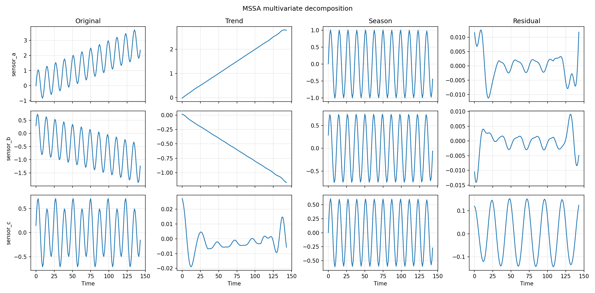
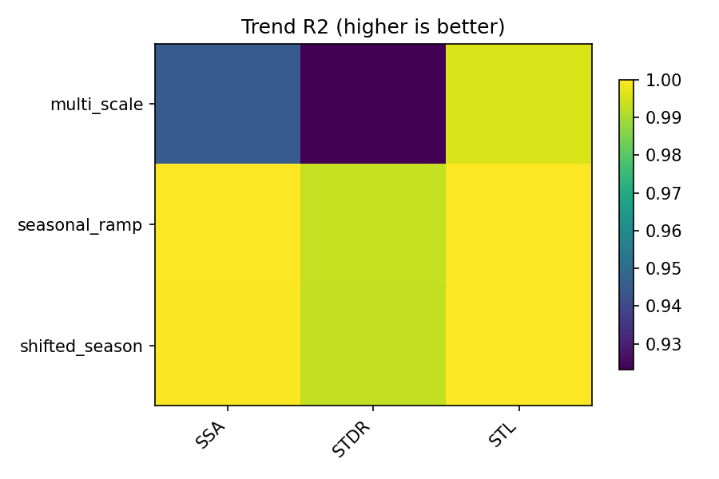

# Example Gallery and Visual Reports

The package ships runnable examples under
[`examples/`](https://github.com/systems-mechanobiology/De-Time/tree/main/examples).
This page acts as the gallery layer above them: one place to see what the
scripts do before opening the source.

## Start with these scripts

| Script | Best for | Output shape |
|---|---|---|
| `univariate_quickstart.py` | first Python decomposition | one clean `DecompResult` |
| `multivariate_mssa.py` | first multivariate workflow | `MSSA` plus channelwise comparison |
| `method_survey.py` | safe subset smoke run | compact method-by-method summary |
| `profile_and_cli.py` | CLI and profiling handoff | generated CSV inputs plus ready-to-run commands |

## Visual reports

| Script | What it produces |
|---|---|
| `visual_univariate_walkthrough.py` | component plot, residual diagnostics, and a real `ssa_summary.csv/json` record |
| `visual_method_comparison.py` | grid view, trend and seasonal overlays, and a real `comparison_summary.csv` |
| `visual_multivariate_walkthrough.py` | multichannel figures, channel overlay, and a real `multivariate_summary.csv` |
| `visual_leaderboard_walkthrough.py` | leaderboard-style heatmaps plus scenario and aggregate summary CSVs |

## Gallery previews

### Univariate walkthrough

[Open the visual univariate tutorial](tutorials/visual-univariate.md)



### Method comparison

[Open the visual method-comparison tutorial](tutorials/visual-comparison.md)



### Multivariate walkthrough

[Open the visual multivariate tutorial](tutorials/visual-multivariate.md)



### Benchmark heatmap walkthrough

[Open the visual benchmark tutorial](tutorials/visual-benchmark.md)



## Run them locally

From the package directory:

```bash
PYTHONPATH=src python3 examples/univariate_quickstart.py
PYTHONPATH=src python3 examples/multivariate_mssa.py
PYTHONPATH=src python3 examples/method_survey.py
PYTHONPATH=src python3 examples/visual_univariate_walkthrough.py
PYTHONPATH=src python3 examples/visual_method_comparison.py
PYTHONPATH=src python3 examples/visual_multivariate_walkthrough.py
PYTHONPATH=src python3 examples/visual_leaderboard_walkthrough.py
```

The point of this page is not to replace the tutorials. It is to show enough
proof that you know which example to open next.
