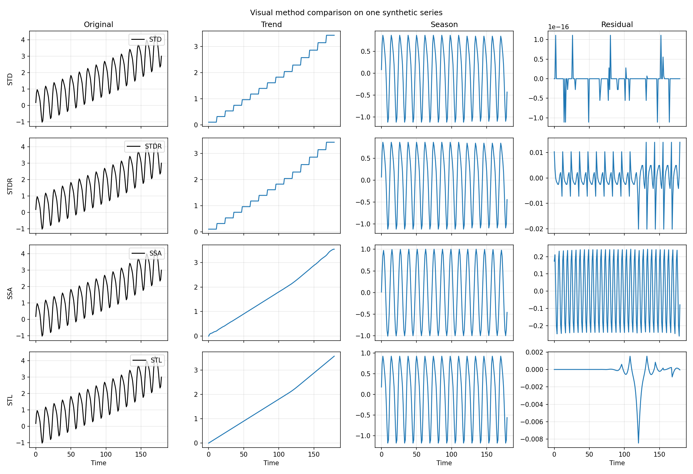

# De-Time

**Research software for reproducible time-series decomposition across classical, subspace, adaptive, and multivariate workflows.**

[Docs](quickstart.md) [Getting Started](quickstart.md) [Tutorials](tutorials/univariate.md) [API](api.md) [GitHub](https://github.com/systems-mechanobiology/De-Time)


<div class="hero-panel">
  <p><strong>De-Time</strong> gives research and engineering teams one public decomposition surface across multiple method families. The homepage stays intentionally short. Tutorials, method notes, and API details live in the docs structure rather than on the landing page.</p>
  <div class="hero-actions">
    <a href="quickstart/">Getting Started</a>
    <a href="tutorials/univariate/" class="secondary">Tutorials</a>
    <a href="api/" class="secondary">API Reference</a>
    <a href="https://github.com/systems-mechanobiology/De-Time" class="secondary">GitHub</a>
  </div>
</div>

<div class="trust-strip">
  <span class="trust-pill">BSD-3-Clause</span>
  <span class="trust-pill">Beta release</span>
  <span class="trust-pill">GitHub Pages docs</span>
  <span class="trust-pill">The University of Birmingham</span>
</div>

<div class="maintainer-card">
  <h3>Maintainer</h3>
  <p><strong>Zipeng Wu</strong><br>The University of Birmingham<br><a href="https://systems-mechanobiology.github.io/De-Time/">systems-mechanobiology.github.io/De-Time</a></p>
</div>

## Product overview

De-Time exists for a common failure mode in scientific software: strong methods
trapped behind inconsistent APIs, unclear outputs, or benchmark-only packaging.
It keeps one decomposition contract while still being honest about method
maturity, backend differences, and optional dependencies.

## One homepage, separate documentation, and a clearer information hierarchy

<div class="info-grid">
  <a class="info-card" href="quickstart/">
    <h3>Getting Started</h3>
    <p>Install the package, run the first decomposition, and understand the public contract fast.</p>
  </a>
  <a class="info-card" href="tutorials/univariate/">
    <h3>Tutorials</h3>
    <p>Move from one series to visual walkthroughs, multivariate workflows, and profiling runs.</p>
  </a>
  <a class="info-card" href="methods/">
    <h3>Methods Atlas</h3>
    <p>See method families, backend story, and current maturity before you commit to a workflow.</p>
  </a>
  <a class="info-card" href="api/">
    <h3>API Reference</h3>
    <p>Keep the public imports, config fields, and result shape contract in one place.</p>
  </a>
  <a class="info-card" href="examples/">
    <h3>Example Gallery</h3>
    <p>Browse runnable scripts and the visual reports already generated from them.</p>
  </a>
  <a class="info-card" href="research-positioning/">
    <h3>Research Positioning</h3>
    <p>Understand how De-Time complements statsmodels, PyWavelets, PyEMD, and vmdpy.</p>
  </a>
  <a class="info-card" href="agent-friendly/">
    <h3>Agent Tools</h3>
    <p>Use the handoff-oriented guidance when another engineer or agent takes over.</p>
  </a>
  <a class="info-card" href="project-status/">
    <h3>Project Files</h3>
    <p>Find citation, release, contributing, roadmap, and security material.</p>
  </a>
</div>

## 60-second quickstart

```bash
pip install de-time
```

```python
import numpy as np
from detime import DecompositionConfig, decompose

t = np.arange(120, dtype=float)
series = 0.03 * t + np.sin(2.0 * np.pi * t / 12.0)

result = decompose(
    series,
    DecompositionConfig(
        method="SSA",
        params={"window": 24, "rank": 6, "primary_period": 12},
    ),
)
```

## Research workflow in four steps

<div class="info-grid">
  <div class="info-card">
    <h3>1. Start small</h3>
    <p>Run one stable method such as <code>SSA</code>, <code>STD</code>, or <code>STDR</code> on a single series first.</p>
  </div>
  <div class="info-card">
    <h3>2. Check interpretability</h3>
    <p>Read the component plots before you trust any larger sweep or downstream metric.</p>
  </div>
  <div class="info-card">
    <h3>3. Compare carefully</h3>
    <p>Use overlays, channelwise baselines, or joint multivariate methods only after a baseline looks believable.</p>
  </div>
  <div class="info-card">
    <h3>4. Scale reproducibly</h3>
    <p>Move to <code>batch</code>, <code>profile</code>, and saved metadata only when the manual read already makes sense.</p>
  </div>
</div>

## Use your own data

| Your data | What De-Time expects first | First path |
|---|---|---|
| One numeric series | one array or one numeric CSV column | `detime run --col value` |
| Wide table with aligned signals | several numeric columns in one table | `detime run --method MSSA --cols x0,x1` |
| Repeated files or experiments | repeatable batch workflow | `detime batch ...` |

## One strong example, then deeper material in docs

<div class="showcase-grid">
  <div class="showcase-card">
    
    <div class="showcase-card-body">
      <h3>Single-series decomposition</h3>
      <p>Use a stable baseline such as <code>SSA</code> or <code>STD</code> to separate long-range structure from seasonal motion and residual variation.</p>
      <p>The point of the first plot is not just aesthetics. It is to decide whether the decomposition is interpretable before you scale to batches or comparisons.</p>
    </div>
  </div>
  <div class="showcase-card">
    
    <div class="showcase-card-body">
      <h3>Shared multivariate structure</h3>
      <p><code>MSSA</code> is the right starting point when cross-channel structure matters and a channelwise baseline is too weak.</p>
      <p>That is the difference between using decomposition as an isolated preprocessing trick and using it as a research workflow primitive.</p>
    </div>
  </div>
</div>

## Visual paths

<div class="visual-card-grid">
  <a class="visual-card" href="tutorials/visual-univariate/">
    
    <div class="visual-card-body">
      <h3>Read One Decomposition</h3>
      <p>Start from one series, one method, and one clean set of component plots.</p>
    </div>
  </a>
  <a class="visual-card" href="tutorials/visual-comparison/">
    
    <div class="visual-card-body">
      <h3>Compare Methods Visually</h3>
      <p>See how trend, season, and residual change across several methods on the same signal.</p>
    </div>
  </a>
  <a class="visual-card" href="tutorials/visual-multivariate/">
    
    <div class="visual-card-body">
      <h3>Inspect Multivariate Structure</h3>
      <p>Compare a true joint method against a channelwise baseline on several channels.</p>
    </div>
  </a>
  <a class="visual-card" href="tutorials/visual-benchmark/">
    
    <div class="visual-card-body">
      <h3>Read Benchmark Heatmaps</h3>
      <p>Turn a small local experiment into a leaderboard-style visual summary.</p>
    </div>
  </a>
</div>

## Next step

Use the docs like a docs site, not like a landing-page appendix.

- Open [Getting Started](quickstart.md) if you want the first successful run.
- Open [Tutorials](tutorials/univariate.md) if you want visual workflows.
- Open [Methods Atlas](methods.md) if you need to choose a method family carefully.
- Open [Research Positioning](research-positioning.md) if you are evaluating the software academically.
