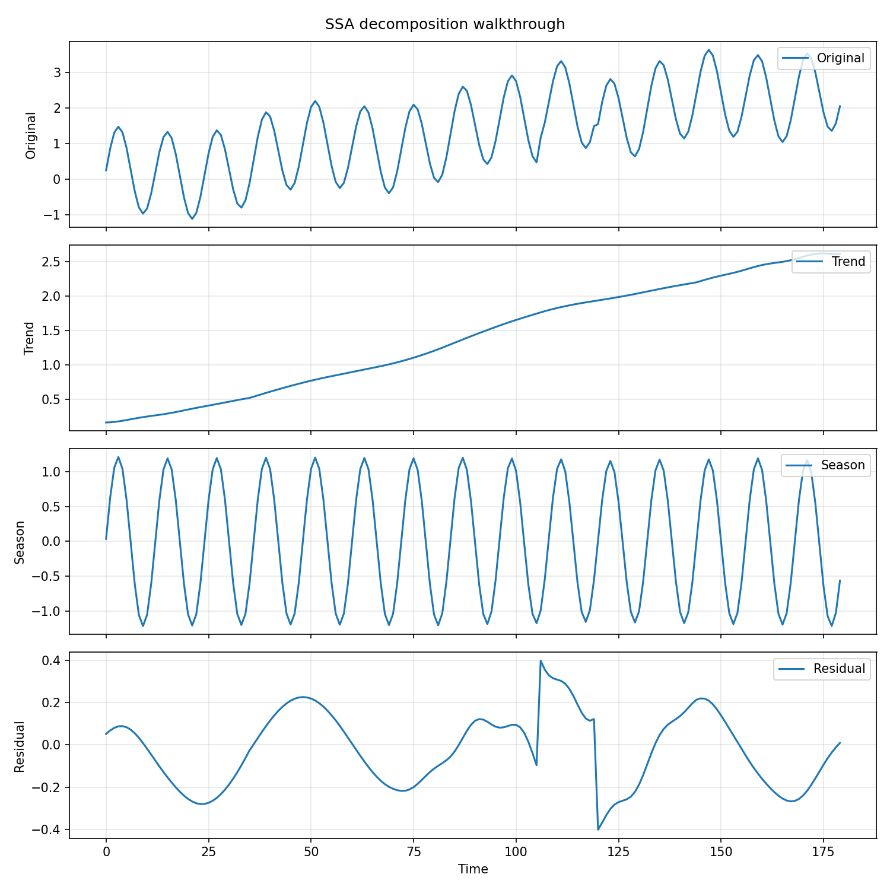
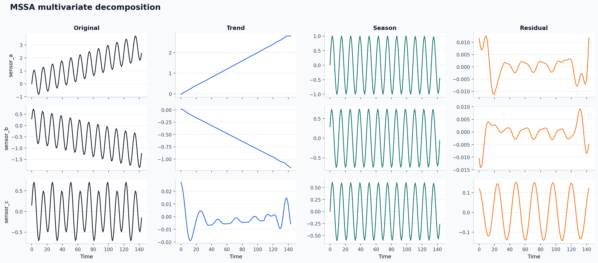

# De-Time

De-Time is workflow-oriented research software for reproducible time-series
decomposition. It gives you one public package, one decomposition contract, and
one set of docs across univariate, multivariate, and native-accelerated
workflows.

## What it is

- A canonical Python package with import path `detime`.
- A stable `decompose()` entrypoint plus `DecompositionConfig` and
  `DecompResult`.
- A documentation set centered on practical workflows rather than benchmark
  scoreboards.
- A package whose flagship methods are `SSA`, `STD`, `STDR`, and `MSSA`.

## What it is not

- Not a new decomposition algorithm.
- Not a benchmark-paper artifact disguised as a library.
- Not a replacement for every specialized upstream implementation.
- Not a promise that every wrapper has the same maturity as the flagship path.

## Start here

- [Install](install.md) for package installation and extras.
- [Quickstart](quickstart.md) for the first successful Python and CLI runs.
- [Choose a Method](choose-a-method.md) for picking a starting workflow.
- [Methods](methods.md) for method family details.
- [Migration from `tsdecomp`](migration.md) if you are upgrading existing code.

## Package boundary

This repository now ships the software package itself. Companion benchmark
artifacts live in the separate `de-time-bench` repository. The main package no
longer exposes benchmark orchestration, leaderboard helpers, or
benchmark-derived methods such as `DR_TS_REG`, `DR_TS_AE`, and `SL_LIB`.

The legacy `tsdecomp` import and CLI still resolve to De-Time, but only as a
deprecated compatibility alias.

## Visual reference

