# De-Time Method Gallery

<div class="gallery-note">
  <strong>Note</strong><br>
  <a href="#download-gallery">Go to the end</a> to download the full notebook, Python source, or zipped example.
</div>

This gallery follows the same pattern as a Sphinx-Gallery example page:
short explanation, executable code blocks, printed output, figures, and
download links. The examples use compact synthetic data so they run quickly
in docs builds and local checkouts.

Regenerate this page and its assets with `python scripts/generate_notebook_gallery.py`.

## Imports and synthetic data

```python
import sys
import warnings
from pathlib import Path

import matplotlib.pyplot as plt
import numpy as np
import pandas as pd
from IPython.display import display

# Prefer the checkout when this notebook is run inside the repository.
repo_src = Path.cwd() / "src"
if (repo_src / "detime").exists():
    sys.meta_path[:] = [
        finder for finder in sys.meta_path
        if finder.__class__.__module__ != "_de_time_editable"
    ]
    sys.path.insert(0, str(repo_src))

from detime import DecompositionConfig, MethodRegistry, decompose

warnings.filterwarnings("ignore", category=FutureWarning)
plt.rcParams.update(
    {
        "figure.figsize": (7.6, 3.0),
        "figure.dpi": 130,
        "savefig.dpi": 220,
        "axes.grid": False,
        "axes.spines.top": False,
        "axes.spines.right": False,
        "font.size": 10,
    }
)

rng = np.random.default_rng(42)
t = np.arange(96, dtype=float)
seasonal = np.sin(2.0 * np.pi * t / 12.0)
slow = 0.018 * t + 0.25 * np.sin(2.0 * np.pi * t / 48.0)
noise = 0.05 * rng.standard_normal(t.shape)
series = slow + seasonal + noise
panel = np.column_stack(
    [
        series,
        0.8 * slow + np.sin(2.0 * np.pi * (t + 2.0) / 12.0) + 0.04 * rng.standard_normal(t.shape),
        1.15 * slow + 0.7 * np.sin(2.0 * np.pi * (t + 4.0) / 12.0) + 0.04 * rng.standard_normal(t.shape),
    ]
)

CASES = {
    "SSA": {"data": series, "config": {"method": "SSA", "params": {"window": 24, "rank": 6, "primary_period": 12}, "backend": "auto", "speed_mode": "exact"}},
    "STD": {"data": series, "config": {"method": "STD", "params": {"period": 12}, "backend": "auto"}},
    "STDR": {"data": series, "config": {"method": "STDR", "params": {"period": 12}, "backend": "auto"}},
    "MSSA": {"data": panel, "config": {"method": "MSSA", "params": {"window": 24, "rank": 6, "primary_period": 12}, "backend": "python", "channel_names": ["a", "b", "c"]}},
    "STL": {"data": series, "config": {"method": "STL", "params": {"period": 12}}},
    "MSTL": {"data": series, "config": {"method": "MSTL", "params": {"periods": [12, 24]}}},
    "ROBUST_STL": {"data": series, "config": {"method": "ROBUST_STL", "params": {"period": 12}}},
    "EMD": {"data": series, "config": {"method": "EMD", "params": {"primary_period": 12, "n_imfs": 4}}},
    "CEEMDAN": {"data": series, "config": {"method": "CEEMDAN", "params": {"primary_period": 12, "trials": 3, "noise_width": 0.03}}},
    "VMD": {"data": series, "config": {"method": "VMD", "params": {"K": 4, "alpha": 300.0, "primary_period": 12}}},
    "WAVELET": {"data": series, "config": {"method": "WAVELET", "params": {"wavelet": "db4", "level": 3}}},
    "MA_BASELINE": {"data": series, "config": {"method": "MA_BASELINE", "params": {"trend_window": 7, "season_period": 12}}},
    "MVMD": {"data": panel, "config": {"method": "MVMD", "params": {"K": 4, "alpha": 300.0, "primary_period": 12}, "channel_names": ["a", "b", "c"]}},
    "MEMD": {"data": panel, "config": {"method": "MEMD", "params": {"primary_period": 12}, "channel_names": ["a", "b", "c"]}},
    "GABOR_CLUSTER": {"data": series, "skip": "requires a trained GaborClusterModel or model_path plus the experimental clustering backend"},
}

GALLERY_RESULTS = []
```

```python
def _plot_vector(values):
    arr = np.asarray(values, dtype=float)
    if arr.ndim == 2:
        return arr[:, 0]
    return arr


def _style_gallery_axis(ax, title):
    ax.set_facecolor("#ffffff")
    ax.grid(True, axis="y", alpha=0.22, color="#94a3b8", linewidth=0.8)
    ax.grid(False, axis="x")
    ax.spines["left"].set_color("#cbd5e1")
    ax.spines["bottom"].set_color("#cbd5e1")
    ax.tick_params(colors="#334155")
    ax.set_title(title, loc="left", fontsize=12, fontweight="bold", color="#0f172a")


def run_gallery_case(name):
    case = CASES[name]
    metadata = MethodRegistry.get_metadata(name)
    print(f"{name}: {metadata['summary']}")
    if "skip" in case:
        row = {
            "method": name,
            "status": "skipped",
            "reason": case["skip"],
            "input_mode": metadata["input_mode"],
            "output_shape": "",
            "residual_rmse": np.nan,
        }
        GALLERY_RESULTS.append(row)
        display(pd.DataFrame([row]))
        return

    data = case["data"]
    cfg = DecompositionConfig(**case["config"])
    try:
        result = decompose(data, cfg)
    except Exception as exc:
        row = {
            "method": name,
            "status": "skipped",
            "reason": f"{type(exc).__name__}: {exc}",
            "input_mode": metadata["input_mode"],
            "output_shape": "",
            "residual_rmse": np.nan,
        }
        GALLERY_RESULTS.append(row)
        display(pd.DataFrame([row]))
        return

    original = _plot_vector(data)
    trend = _plot_vector(result.trend)
    season = _plot_vector(result.season)
    residual = _plot_vector(result.residual)
    reconstruction = trend + season + residual
    rmse = float(np.sqrt(np.mean((original - reconstruction) ** 2)))

    row = {
        "method": name,
        "status": "ran",
        "reason": "",
        "input_mode": metadata["input_mode"],
        "output_shape": str(np.asarray(result.trend).shape),
        "residual_rmse": round(rmse, 8),
    }
    GALLERY_RESULTS.append(row)
    display(pd.DataFrame([row]))

    fig, ax = plt.subplots(facecolor="#f8fafc")
    ax.plot(original, label="input", color="#0f172a", linewidth=1.6)
    ax.plot(trend, label="trend", color="#2563eb", linewidth=1.4)
    ax.plot(season, label="season", color="#0f766e", linewidth=1.2)
    ax.plot(residual, label="residual", color="#f97316", linewidth=1.0, alpha=0.85)
    _style_gallery_axis(ax, f"{name} decomposition")
    ax.set_xlabel("time step")
    ax.legend(loc="upper right", ncol=2, fontsize=8, frameon=True, framealpha=0.92)
    fig.tight_layout()
    plt.show()
```

## Univariate SSA

```python
case = CASES["SSA"]
run_gallery_case("SSA")
```

Out:

<div class="gallery-out">
<pre>
SSA: Singular spectrum analysis for structured univariate decomposition.
status: ran
input mode: univariate
trend shape: (96,)
backend: native
residual RMSE: 0.00000000
</pre>
</div>

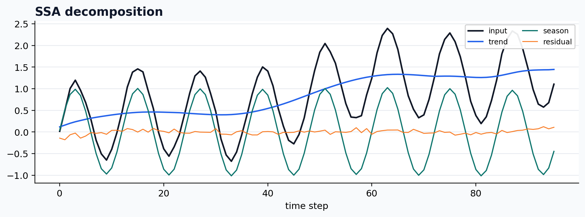

## Seasonal-trend decomposition

```python
case = CASES["STD"]
run_gallery_case("STD")
```

Out:

<div class="gallery-out">
<pre>
STD: Fast seasonal-trend decomposition with dispersion-aware diagnostics.
status: ran
input mode: channelwise
trend shape: (96,)
backend: native
residual RMSE: 0.00000000
</pre>
</div>

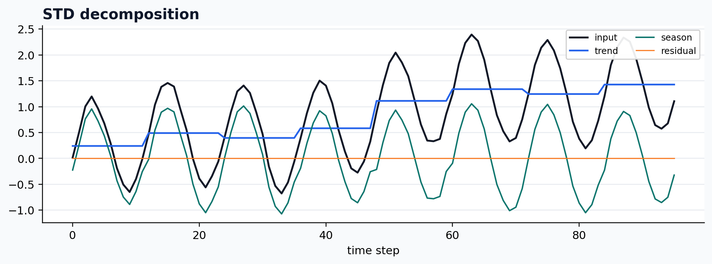

## Robust seasonal-trend decomposition

```python
case = CASES["STDR"]
run_gallery_case("STDR")
```

Out:

<div class="gallery-out">
<pre>
STDR: Robust seasonal-trend decomposition for noisier periodic signals.
status: ran
input mode: channelwise
trend shape: (96,)
backend: native
residual RMSE: 0.00000000
</pre>
</div>

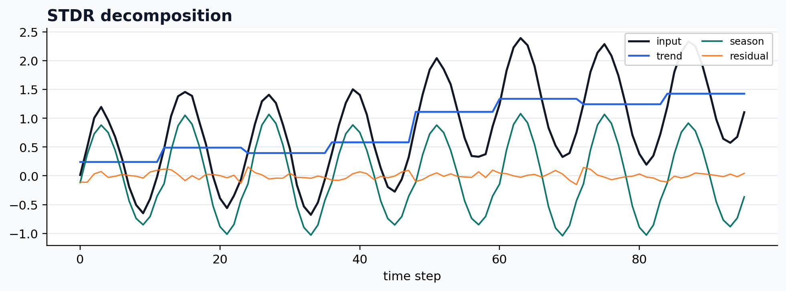

## Multivariate SSA

```python
case = CASES["MSSA"]
run_gallery_case("MSSA")
```

Out:

<div class="gallery-out">
<pre>
MSSA: Multivariate SSA for shared-structure decomposition across channels.
status: ran
input mode: multivariate
trend shape: (96, 3)
backend: python
residual RMSE: 0.00000000
</pre>
</div>

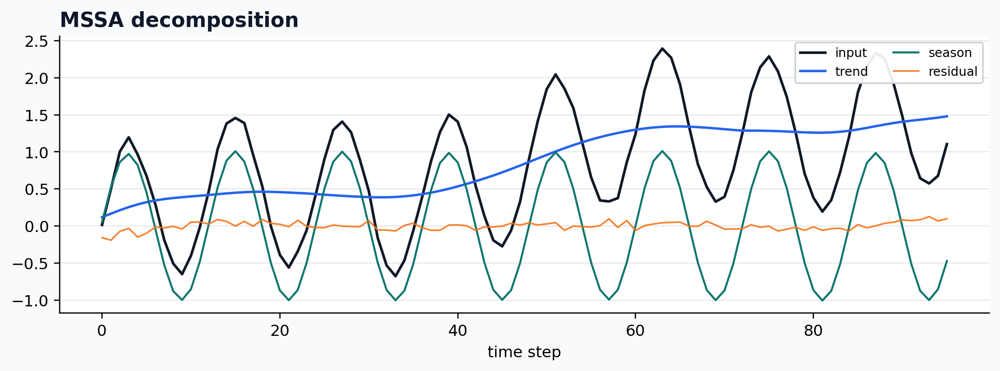

## Statsmodels STL wrapper

```python
case = CASES["STL"]
run_gallery_case("STL")
```

Out:

<div class="gallery-out">
<pre>
STL: Classical STL wrapped into the De-Time workflow contract.
status: ran
input mode: univariate
trend shape: (96,)
backend: python
residual RMSE: 0.00000000
</pre>
</div>

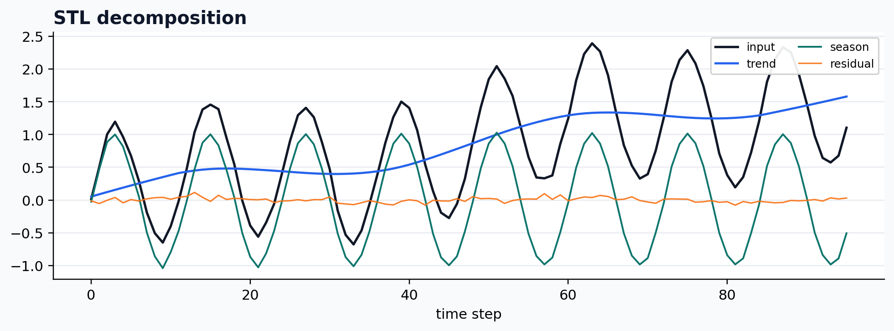

## Statsmodels MSTL wrapper

```python
case = CASES["MSTL"]
run_gallery_case("MSTL")
```

Out:

<div class="gallery-out">
<pre>
MSTL: Statsmodels MSTL wrapped into the De-Time workflow surface.
status: ran
input mode: univariate
trend shape: (96,)
backend: python
residual RMSE: 0.00000000
</pre>
</div>

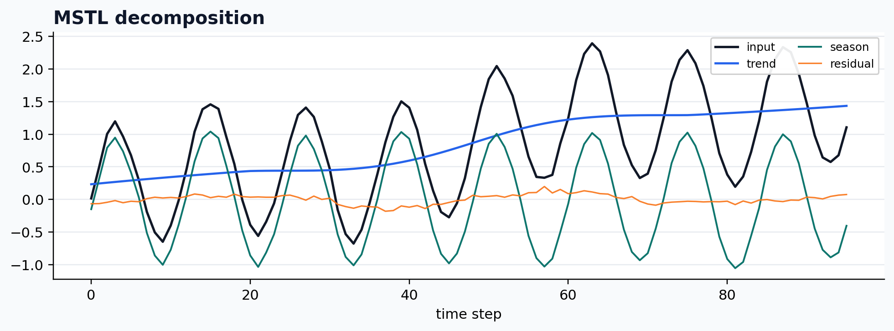

## Robust STL wrapper

```python
case = CASES["ROBUST_STL"]
run_gallery_case("ROBUST_STL")
```

Out:

<div class="gallery-out">
<pre>
ROBUST_STL: Robust STL-style decomposition wrapped for reproducible workflows.
status: ran
input mode: univariate
trend shape: (96,)
backend: python
residual RMSE: 0.00000000
</pre>
</div>

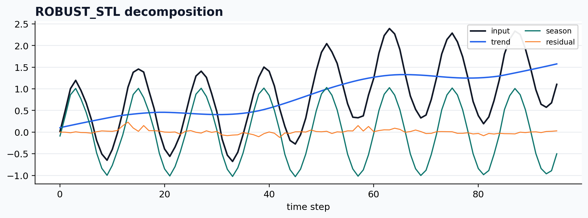

## Empirical mode decomposition

```python
case = CASES["EMD"]
run_gallery_case("EMD")
```

Out:

<div class="gallery-out">
<pre>
EMD: Empirical mode decomposition under the De-Time result contract.
status: ran
input mode: univariate
trend shape: (96,)
backend: python
residual RMSE: 0.00000000
</pre>
</div>

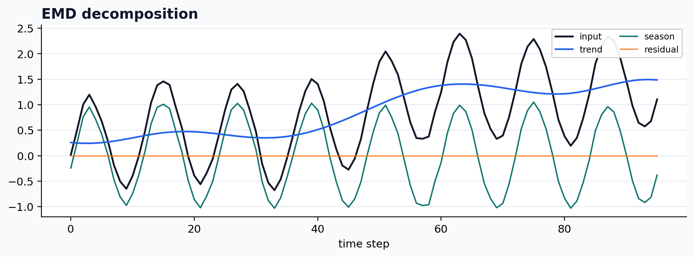

## Noise-assisted EMD

```python
case = CASES["CEEMDAN"]
run_gallery_case("CEEMDAN")
```

Out:

<div class="gallery-out">
<pre>
CEEMDAN: Noise-assisted EMD variant for more stable IMF extraction.
status: ran
input mode: univariate
trend shape: (96,)
backend: python
residual RMSE: 0.00000000
</pre>
</div>

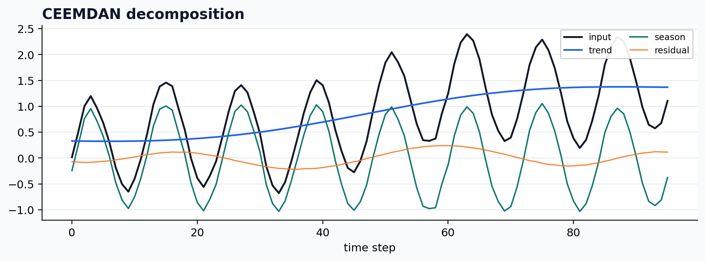

## Variational mode decomposition

```python
case = CASES["VMD"]
run_gallery_case("VMD")
```

Out:

<div class="gallery-out">
<pre>
VMD: Variational mode decomposition integrated into the common workflow layer.
status: ran
input mode: univariate
trend shape: (96,)
backend: python
residual RMSE: 0.03421948
</pre>
</div>

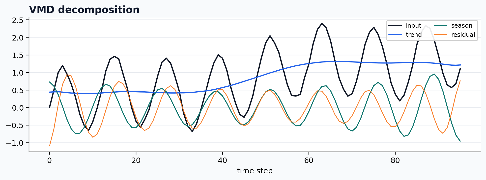

## Wavelet decomposition

```python
case = CASES["WAVELET"]
run_gallery_case("WAVELET")
```

Out:

<div class="gallery-out">
<pre>
WAVELET: Wavelet-based decomposition exposed through the common output contract.
status: ran
input mode: univariate
trend shape: (96,)
backend: python
residual RMSE: 0.00000000
</pre>
</div>

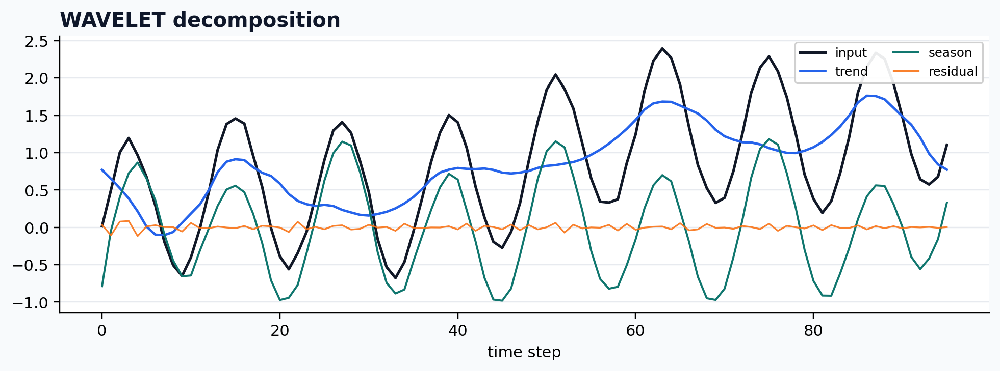

## Moving-average baseline

```python
case = CASES["MA_BASELINE"]
run_gallery_case("MA_BASELINE")
```

Out:

<div class="gallery-out">
<pre>
MA_BASELINE: Simple moving-average baseline for smoke tests and lightweight workflows.
status: ran
input mode: univariate
trend shape: (96,)
backend: python
residual RMSE: 0.00000000
</pre>
</div>

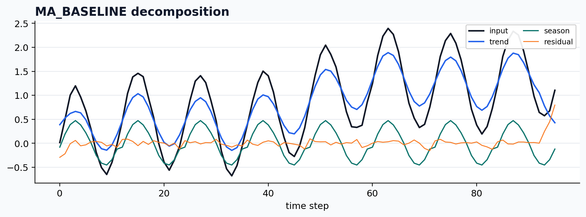

## Optional multivariate VMD backend

```python
case = CASES["MVMD"]
run_gallery_case("MVMD")
```

Out:

<div class="gallery-out">
<pre>
MVMD: Optional multivariate VMD backend for shared frequency structure.
status: ran
input mode: multivariate
trend shape: (96, 3)
backend: python
residual RMSE: 0.08323657
</pre>
</div>

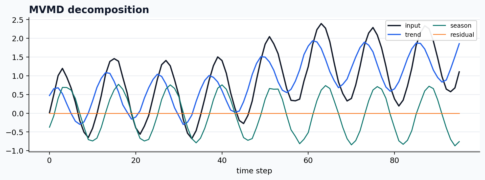

## Optional multivariate EMD backend

```python
case = CASES["MEMD"]
run_gallery_case("MEMD")
```

Out:

<div class="gallery-out">
<pre>
MEMD: Optional multivariate EMD backend for shared oscillatory structure.
status: ran
input mode: multivariate
trend shape: (96, 3)
backend: python
residual RMSE: 0.00000000
</pre>
</div>

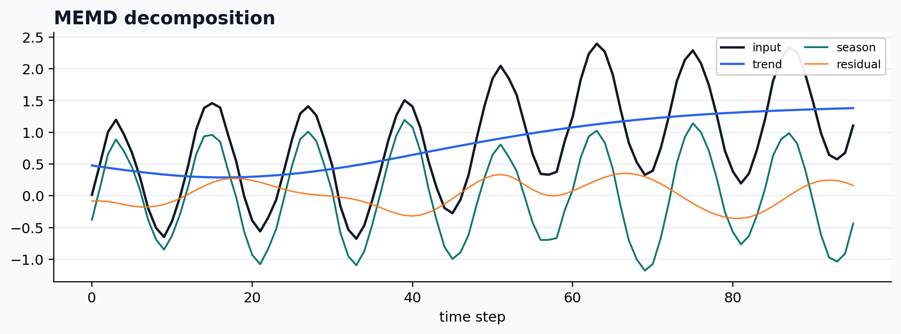

## Experimental Gabor clustering path

```python
case = CASES["GABOR_CLUSTER"]
print(case["skip"])
```

Out:

<div class="gallery-out">
<pre>
requires a trained GaborClusterModel or model_path plus the experimental clustering backend
</pre>
</div>

## Summary

| Method | Status | Input mode | Trend shape | Residual RMSE |
|---|---|---|---|---:|
| `SSA` | ran | `univariate` | `(96,)` | 0.00000000 |
| `STD` | ran | `channelwise` | `(96,)` | 0.00000000 |
| `STDR` | ran | `channelwise` | `(96,)` | 0.00000000 |
| `MSSA` | ran | `multivariate` | `(96, 3)` | 0.00000000 |
| `STL` | ran | `univariate` | `(96,)` | 0.00000000 |
| `MSTL` | ran | `univariate` | `(96,)` | 0.00000000 |
| `ROBUST_STL` | ran | `univariate` | `(96,)` | 0.00000000 |
| `EMD` | ran | `univariate` | `(96,)` | 0.00000000 |
| `CEEMDAN` | ran | `univariate` | `(96,)` | 0.00000000 |
| `VMD` | ran | `univariate` | `(96,)` | 0.03421948 |
| `WAVELET` | ran | `univariate` | `(96,)` | 0.00000000 |
| `MA_BASELINE` | ran | `univariate` | `(96,)` | 0.00000000 |
| `MVMD` | ran | `multivariate` | `(96, 3)` | 0.08323657 |
| `MEMD` | ran | `multivariate` | `(96, 3)` | 0.00000000 |
| `GABOR_CLUSTER` | skipped | `univariate` | `` | n/a |

Total running time of the gallery script: 4.716 seconds.

Methods run: 14; skipped with explicit reason: 1.

<a id="download-gallery"></a>

## Downloads

<div class="download-grid">
  <a class="download-card" href="../assets/generated/notebooks/method-gallery/de_time_method_gallery.ipynb">Download Jupyter notebook: <code>de_time_method_gallery.ipynb</code></a>
  <a class="download-card" href="../assets/generated/notebooks/method-gallery/de_time_method_gallery.py">Download Python source code: <code>de_time_method_gallery.py</code></a>
  <a class="download-card" href="../assets/generated/notebooks/method-gallery/de_time_method_gallery.zip">Download zipped example: <code>de_time_method_gallery.zip</code></a>
</div>

The GitHub-rendered notebook is also available at
[examples/notebooks/de_time_method_gallery.ipynb](https://github.com/systems-mechanobiology/De-Time/blob/main/examples/notebooks/de_time_method_gallery.ipynb).
