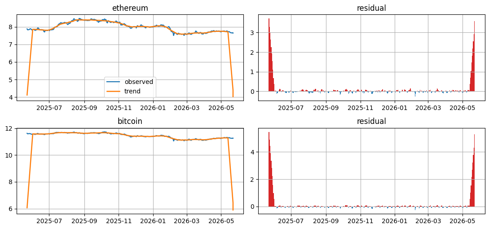
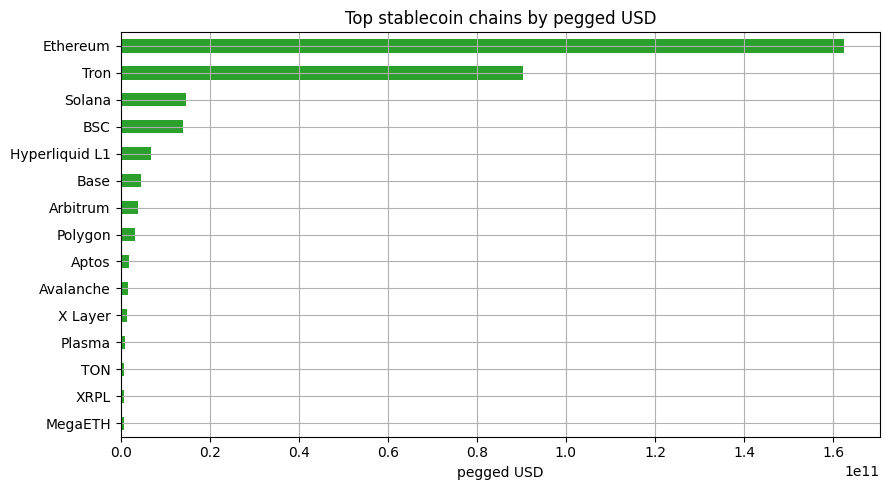

<!-- Generated by scripts/generate_column_notebook_pages.py; do not edit manually. -->
# Crypto and Stablecoin Liquidity Pulse

<div class="gallery-note notebook-transcript-note">
  <strong>Rendered notebook transcript.</strong> This page is generated from <a href="https://github.com/systems-mechanobiology/De-Time/blob/main/examples/notebooks/hot_trends/06_crypto_stablecoin_liquidity_pulse.ipynb"><code>examples/notebooks/hot_trends/06_crypto_stablecoin_liquidity_pulse.ipynb</code></a> and includes code cells plus captured outputs from the committed notebook.
</div>

This notebook uses public crypto-market and DeFi liquidity data to describe recent market structure.

Sources:

- CoinGecko market chart for BTC/ETH price history;
- DeFiLlama stablecoin data for liquidity context.

Data sources are recorded in the source audit table.

<div class="notebook-cell">
<div class="notebook-input-label">In [1]</div>

```python
from pathlib import Path
import os

import matplotlib.pyplot as plt
import numpy as np
import pandas as pd

from examples.hot_trends.data import (
    HotTrendDataError,
    append_real_snapshot,
    build_arxiv_monthly_counts,
    fetch_coingecko_market_chart,
    fetch_defillama_stablecoin_chains,
    fetch_github_repo_metadata,
    fetch_github_stargazers,
    fetch_huggingface_models,
    fetch_wikipedia_pageviews,
    source_audit_table,
)
from examples.hot_trends.decomposition import (
    component_summary,
    decompose_table,
    editorial_priority,
    residual_event_table,
)
from examples.hot_trends.scoring import article_publication_phrasing

pd.set_option("display.max_columns", 80)
pd.set_option("display.max_rows", 80)
plt.rcParams.update({"axes.grid": True})

CACHE_DIR = Path("examples/hot_trends/cache")
OUTPUT_DIR = Path("examples/hot_trends/outputs")
CACHE_DIR.mkdir(parents=True, exist_ok=True)
OUTPUT_DIR.mkdir(parents=True, exist_ok=True)

def save_table(df, name):
    path = OUTPUT_DIR / f"{name}.csv"
    df.to_csv(path, index=False)
    print(f"saved: {path.as_posix()}")
```
</div>

## 1. Fetch real BTC and ETH market charts

<div class="notebook-cell">
<div class="notebook-input-label">In [2]</div>

```python
coins = ["bitcoin", "ethereum"]
frames = [fetch_coingecko_market_chart(c, days=365) for c in coins]
prices = pd.concat(frames, ignore_index=True)
prices.head(20)
```

<div class="gallery-out notebook-output">
<div class="notebook-output-label">text/html</div>
<div class="notebook-html-output">
<div>
<style scoped>
    .dataframe tbody tr th:only-of-type {
        vertical-align: middle;
    }

    .dataframe tbody tr th {
        vertical-align: top;
    }

    .dataframe thead th {
        text-align: right;
    }
</style>
<table border="1" class="dataframe">
  <thead>
    <tr style="text-align: right;">
      <th></th>
      <th>date</th>
      <th>coin_id</th>
      <th>price</th>
      <th>source</th>
      <th>data_quality</th>
    </tr>
  </thead>
  <tbody>
    <tr>
      <th>0</th>
      <td>2025-05-23</td>
      <td>bitcoin</td>
      <td>111560.356938</td>
      <td>CoinGecko API</td>
      <td>public_api_snapshot</td>
    </tr>
    <tr>
      <th>1</th>
      <td>2025-05-24</td>
      <td>bitcoin</td>
      <td>107216.668569</td>
      <td>CoinGecko API</td>
      <td>public_api_snapshot</td>
    </tr>
    <tr>
      <th>2</th>
      <td>2025-05-25</td>
      <td>bitcoin</td>
      <td>107831.363744</td>
      <td>CoinGecko API</td>
      <td>public_api_snapshot</td>
    </tr>
    <tr>
      <th>3</th>
      <td>2025-05-26</td>
      <td>bitcoin</td>
      <td>108861.810377</td>
      <td>CoinGecko API</td>
      <td>public_api_snapshot</td>
    </tr>
    <tr>
      <th>4</th>
      <td>2025-05-27</td>
      <td>bitcoin</td>
      <td>109377.715133</td>
      <td>CoinGecko API</td>
      <td>public_api_snapshot</td>
    </tr>
    <tr>
      <th>5</th>
      <td>2025-05-28</td>
      <td>bitcoin</td>
      <td>109068.456949</td>
      <td>CoinGecko API</td>
      <td>public_api_snapshot</td>
    </tr>
    <tr>
      <th>6</th>
      <td>2025-05-29</td>
      <td>bitcoin</td>
      <td>107838.184311</td>
      <td>CoinGecko API</td>
      <td>public_api_snapshot</td>
    </tr>
    <tr>
      <th>7</th>
      <td>2025-05-30</td>
      <td>bitcoin</td>
      <td>105745.416604</td>
      <td>CoinGecko API</td>
      <td>public_api_snapshot</td>
    </tr>
    <tr>
      <th>8</th>
      <td>2025-05-31</td>
      <td>bitcoin</td>
      <td>104010.919562</td>
      <td>CoinGecko API</td>
      <td>public_api_snapshot</td>
    </tr>
    <tr>
      <th>9</th>
      <td>2025-06-01</td>
      <td>bitcoin</td>
      <td>104687.507429</td>
      <td>CoinGecko API</td>
      <td>public_api_snapshot</td>
    </tr>
    <tr>
      <th>10</th>
      <td>2025-06-02</td>
      <td>bitcoin</td>
      <td>105710.005938</td>
      <td>CoinGecko API</td>
      <td>public_api_snapshot</td>
    </tr>
    <tr>
      <th>11</th>
      <td>2025-06-03</td>
      <td>bitcoin</td>
      <td>105884.742632</td>
      <td>CoinGecko API</td>
      <td>public_api_snapshot</td>
    </tr>
    <tr>
      <th>12</th>
      <td>2025-06-04</td>
      <td>bitcoin</td>
      <td>105434.477451</td>
      <td>CoinGecko API</td>
      <td>public_api_snapshot</td>
    </tr>
    <tr>
      <th>13</th>
      <td>2025-06-05</td>
      <td>bitcoin</td>
      <td>104812.918219</td>
      <td>CoinGecko API</td>
      <td>public_api_snapshot</td>
    </tr>
    <tr>
      <th>14</th>
      <td>2025-06-06</td>
      <td>bitcoin</td>
      <td>101650.738755</td>
      <td>CoinGecko API</td>
      <td>public_api_snapshot</td>
    </tr>
    <tr>
      <th>15</th>
      <td>2025-06-07</td>
      <td>bitcoin</td>
      <td>104409.749680</td>
      <td>CoinGecko API</td>
      <td>public_api_snapshot</td>
    </tr>
    <tr>
      <th>16</th>
      <td>2025-06-08</td>
      <td>bitcoin</td>
      <td>105681.454614</td>
      <td>CoinGecko API</td>
      <td>public_api_snapshot</td>
    </tr>
    <tr>
      <th>17</th>
      <td>2025-06-09</td>
      <td>bitcoin</td>
      <td>105692.247407</td>
      <td>CoinGecko API</td>
      <td>public_api_snapshot</td>
    </tr>
    <tr>
      <th>18</th>
      <td>2025-06-10</td>
      <td>bitcoin</td>
      <td>110261.574859</td>
      <td>CoinGecko API</td>
      <td>public_api_snapshot</td>
    </tr>
    <tr>
      <th>19</th>
      <td>2025-06-11</td>
      <td>bitcoin</td>
      <td>110212.732521</td>
      <td>CoinGecko API</td>
      <td>public_api_snapshot</td>
    </tr>
  </tbody>
</table>
</div>
</div>
</div>
</div>

## 2. Audit real price table

<div class="notebook-cell">
<div class="notebook-input-label">In [3]</div>

```python
audit = source_audit_table(prices, value_col="price", entity_col="coin_id", time_col="date")
audit
```

<div class="gallery-out notebook-output">
<div class="notebook-output-label">text/html</div>
<div class="notebook-html-output">
<div>
<style scoped>
    .dataframe tbody tr th:only-of-type {
        vertical-align: middle;
    }

    .dataframe tbody tr th {
        vertical-align: top;
    }

    .dataframe thead th {
        text-align: right;
    }
</style>
<table border="1" class="dataframe">
  <thead>
    <tr style="text-align: right;">
      <th></th>
      <th>series</th>
      <th>first_timestamp</th>
      <th>last_timestamp</th>
      <th>observations</th>
      <th>missing_ratio</th>
      <th>min_value</th>
      <th>max_value</th>
    </tr>
  </thead>
  <tbody>
    <tr>
      <th>0</th>
      <td>bitcoin</td>
      <td>2025-05-23 00:00:00</td>
      <td>2026-05-22 00:00:00</td>
      <td>366</td>
      <td>0.0</td>
      <td>62853.690384</td>
      <td>124773.508231</td>
    </tr>
    <tr>
      <th>1</th>
      <td>ethereum</td>
      <td>2025-05-23 00:00:00</td>
      <td>2026-05-22 00:00:00</td>
      <td>366</td>
      <td>0.0</td>
      <td>1820.569322</td>
      <td>4829.225542</td>
    </tr>
  </tbody>
</table>
</div>
</div>
</div>
</div>

## 3. Decompose crypto price series

<div class="notebook-cell">
<div class="notebook-input-label">In [4]</div>

```python
components = decompose_table(prices, entity_col="coin_id", time_col="date", value_col="price", method="MA_BASELINE", period=7, trend_window=21, transform="log")
summary = editorial_priority(component_summary(components, entity_col="coin_id", time_col="date"), entity_col="coin_id")
summary
```

<div class="gallery-out notebook-output">
<div class="notebook-output-label">text/html</div>
<div class="notebook-html-output">
<div>
<style scoped>
    .dataframe tbody tr th:only-of-type {
        vertical-align: middle;
    }

    .dataframe tbody tr th {
        vertical-align: top;
    }

    .dataframe thead th {
        text-align: right;
    }
</style>
<table border="1" class="dataframe">
  <thead>
    <tr style="text-align: right;">
      <th></th>
      <th>coin_id</th>
      <th>observations</th>
      <th>first_timestamp</th>
      <th>last_timestamp</th>
      <th>trend_last</th>
      <th>trend_slope_per_step</th>
      <th>cycle_strength_proxy</th>
      <th>residual_std</th>
      <th>max_abs_residual_z</th>
      <th>method</th>
      <th>trend_slope_per_step_rank_pct</th>
      <th>cycle_strength_proxy_rank_pct</th>
      <th>max_abs_residual_z_rank_pct</th>
      <th>editorial_priority_score</th>
    </tr>
  </thead>
  <tbody>
    <tr>
      <th>1</th>
      <td>ethereum</td>
      <td>366</td>
      <td>2025-05-23 00:00:00</td>
      <td>2026-05-22 00:00:00</td>
      <td>4.025442</td>
      <td>-0.001398</td>
      <td>-2.727087</td>
      <td>0.523240</td>
      <td>64.191978</td>
      <td>MA_BASELINE</td>
      <td>1.0</td>
      <td>1.0</td>
      <td>0.5</td>
      <td>0.775</td>
    </tr>
    <tr>
      <th>0</th>
      <td>bitcoin</td>
      <td>366</td>
      <td>2025-05-23 00:00:00</td>
      <td>2026-05-22 00:00:00</td>
      <td>5.901926</td>
      <td>-0.001547</td>
      <td>-14.437076</td>
      <td>0.770724</td>
      <td>125.712740</td>
      <td>MA_BASELINE</td>
      <td>0.5</td>
      <td>0.5</td>
      <td>1.0</td>
      <td>0.725</td>
    </tr>
  </tbody>
</table>
</div>
</div>
</div>
</div>

## Visualization: crypto price components

BTC and ETH are plotted as transformed price components so trend and residual shocks are visible.

<div class="notebook-cell">
<div class="notebook-input-label">In [5]</div>

```python
coins_to_plot = summary["coin_id"].tolist()
fig, axes = plt.subplots(len(coins_to_plot), 2, figsize=(11, max(3.0, 2.6 * len(coins_to_plot))), squeeze=False)
for row, coin_id in enumerate(coins_to_plot):
    panel = components.loc[components["coin_id"].eq(coin_id)].sort_values("date").copy()
    panel["date"] = pd.to_datetime(panel["date"])
    axes[row, 0].plot(panel["date"], panel["observed"], label="observed", linewidth=1.6)
    axes[row, 0].plot(panel["date"], panel["trend"], label="trend", linewidth=1.8)
    axes[row, 0].set_title(coin_id)
    axes[row, 1].bar(panel["date"], panel["residual"], color=np.where(panel["residual"] >= 0, "tab:red", "tab:blue"), width=1.0)
    axes[row, 1].set_title("residual")
axes[0, 0].legend(loc="best")
plt.tight_layout()
plt.show()
```

<div class="gallery-out notebook-output">
<div class="notebook-output-label">image/png</div>

</div>
</div>

## 4. Residual events

<div class="notebook-cell">
<div class="notebook-input-label">In [6]</div>

```python
events = residual_event_table(components, entity_col="coin_id", time_col="date", top_n=20)
events
```

<div class="gallery-out notebook-output">
<div class="notebook-output-label">text/html</div>
<div class="notebook-html-output">
<div>
<style scoped>
    .dataframe tbody tr th:only-of-type {
        vertical-align: middle;
    }

    .dataframe tbody tr th {
        vertical-align: top;
    }

    .dataframe thead th {
        text-align: right;
    }
</style>
<table border="1" class="dataframe">
  <thead>
    <tr style="text-align: right;">
      <th></th>
      <th>date</th>
      <th>coin_id</th>
      <th>observed</th>
      <th>trend</th>
      <th>season</th>
      <th>residual</th>
      <th>residual_z</th>
      <th>abs_residual_z</th>
      <th>method</th>
    </tr>
  </thead>
  <tbody>
    <tr>
      <th>0</th>
      <td>2025-05-23</td>
      <td>bitcoin</td>
      <td>11.622321</td>
      <td>6.068095</td>
      <td>0.080769</td>
      <td>5.473457</td>
      <td>125.712740</td>
      <td>125.712740</td>
      <td>MA_BASELINE</td>
    </tr>
    <tr>
      <th>1</th>
      <td>2026-05-22</td>
      <td>bitcoin</td>
      <td>11.258631</td>
      <td>5.901926</td>
      <td>0.079347</td>
      <td>5.277358</td>
      <td>121.189134</td>
      <td>121.189134</td>
      <td>MA_BASELINE</td>
    </tr>
    <tr>
      <th>2</th>
      <td>2025-05-24</td>
      <td>bitcoin</td>
      <td>11.582607</td>
      <td>6.619053</td>
      <td>0.079347</td>
      <td>4.884207</td>
      <td>112.119937</td>
      <td>112.119937</td>
      <td>MA_BASELINE</td>
    </tr>
    <tr>
      <th>3</th>
      <td>2026-05-22</td>
      <td>bitcoin</td>
      <td>11.243608</td>
      <td>6.440551</td>
      <td>0.080769</td>
      <td>4.722288</td>
      <td>108.384780</td>
      <td>108.384780</td>
      <td>MA_BASELINE</td>
    </tr>
    <tr>
      <th>4</th>
      <td>2025-05-25</td>
      <td>bitcoin</td>
      <td>11.588324</td>
      <td>7.169807</td>
      <td>-0.031227</td>
      <td>4.449744</td>
      <td>102.097739</td>
      <td>102.097739</td>
      <td>MA_BASELINE</td>
    </tr>
    <tr>
      <th>5</th>
      <td>2026-05-21</td>
      <td>bitcoin</td>
      <td>11.257516</td>
      <td>6.979420</td>
      <td>-0.022145</td>
      <td>4.300241</td>
      <td>98.649005</td>
      <td>98.649005</td>
      <td>MA_BASELINE</td>
    </tr>
    <tr>
      <th>6</th>
      <td>2025-05-26</td>
      <td>bitcoin</td>
      <td>11.597835</td>
      <td>7.720280</td>
      <td>-0.039315</td>
      <td>3.916869</td>
      <td>89.805382</td>
      <td>89.805382</td>
      <td>MA_BASELINE</td>
    </tr>
    <tr>
      <th>7</th>
      <td>2026-05-20</td>
      <td>bitcoin</td>
      <td>11.249075</td>
      <td>7.517430</td>
      <td>-0.036103</td>
      <td>3.767747</td>
      <td>86.365433</td>
      <td>86.365433</td>
      <td>MA_BASELINE</td>
    </tr>
    <tr>
      <th>8</th>
      <td>2025-05-27</td>
      <td>bitcoin</td>
      <td>11.602562</td>
      <td>8.269294</td>
      <td>-0.034406</td>
      <td>3.367674</td>
      <td>77.136548</td>
      <td>77.136548</td>
      <td>MA_BASELINE</td>
    </tr>
    <tr>
      <th>9</th>
      <td>2026-05-19</td>
      <td>bitcoin</td>
      <td>11.250940</td>
      <td>8.055151</td>
      <td>-0.034406</td>
      <td>3.230195</td>
      <td>73.965169</td>
      <td>73.965169</td>
      <td>MA_BASELINE</td>
    </tr>
    <tr>
      <th>10</th>
      <td>2025-05-28</td>
      <td>bitcoin</td>
      <td>11.599731</td>
      <td>8.819584</td>
      <td>-0.036103</td>
      <td>2.816250</td>
      <td>64.416296</td>
      <td>64.416296</td>
      <td>MA_BASELINE</td>
    </tr>
    <tr>
      <th>11</th>
      <td>2025-05-23</td>
      <td>ethereum</td>
      <td>7.885016</td>
      <td>4.114704</td>
      <td>0.052519</td>
      <td>3.717793</td>
      <td>64.191978</td>
      <td>64.191978</td>
      <td>MA_BASELINE</td>
    </tr>
    <tr>
      <th>12</th>
      <td>2026-05-18</td>
      <td>bitcoin</td>
      <td>11.257074</td>
      <td>8.592773</td>
      <td>-0.039315</td>
      <td>2.703616</td>
      <td>61.818053</td>
      <td>61.818053</td>
      <td>MA_BASELINE</td>
    </tr>
    <tr>
      <th>13</th>
      <td>2026-05-22</td>
      <td>ethereum</td>
      <td>7.647484</td>
      <td>4.025442</td>
      <td>0.050701</td>
      <td>3.571341</td>
      <td>61.657767</td>
      <td>61.657767</td>
      <td>MA_BASELINE</td>
    </tr>
    <tr>
      <th>14</th>
      <td>2025-05-24</td>
      <td>ethereum</td>
      <td>7.831940</td>
      <td>4.489323</td>
      <td>0.050701</td>
      <td>3.291916</td>
      <td>56.822568</td>
      <td>56.822568</td>
      <td>MA_BASELINE</td>
    </tr>
    <tr>
      <th>15</th>
      <td>2026-05-22</td>
      <td>ethereum</td>
      <td>7.664672</td>
      <td>4.394858</td>
      <td>0.052519</td>
      <td>3.217295</td>
      <td>55.531332</td>
      <td>55.531332</td>
      <td>MA_BASELINE</td>
    </tr>
    <tr>
      <th>16</th>
      <td>2025-05-25</td>
      <td>ethereum</td>
      <td>7.835754</td>
      <td>4.863681</td>
      <td>-0.024403</td>
      <td>2.996476</td>
      <td>51.710261</td>
      <td>51.710261</td>
      <td>MA_BASELINE</td>
    </tr>
    <tr>
      <th>17</th>
      <td>2025-05-29</td>
      <td>bitcoin</td>
      <td>11.588387</td>
      <td>9.370450</td>
      <td>-0.022145</td>
      <td>2.240082</td>
      <td>51.125251</td>
      <td>51.125251</td>
      <td>MA_BASELINE</td>
    </tr>
    <tr>
      <th>18</th>
      <td>2026-05-21</td>
      <td>ethereum</td>
      <td>7.662606</td>
      <td>4.764865</td>
      <td>-0.008157</td>
      <td>2.905898</td>
      <td>50.142890</td>
      <td>50.142890</td>
      <td>MA_BASELINE</td>
    </tr>
    <tr>
      <th>19</th>
      <td>2026-05-17</td>
      <td>bitcoin</td>
      <td>11.266194</td>
      <td>9.131222</td>
      <td>-0.031227</td>
      <td>2.166198</td>
      <td>49.420905</td>
      <td>49.420905</td>
      <td>MA_BASELINE</td>
    </tr>
  </tbody>
</table>
</div>
</div>
</div>
</div>

## 5. Fetch stablecoin context from DeFiLlama

This cell reads the DeFiLlama stablecoin endpoint schema and records the table used for the liquidity summary.

<div class="notebook-cell">
<div class="notebook-input-label">In [7]</div>

```python
stable_chains = fetch_defillama_stablecoin_chains()
stable_chains.head(20)
```

<div class="gallery-out notebook-output">
<div class="notebook-output-label">text/html</div>
<div class="notebook-html-output">
<div>
<style scoped>
    .dataframe tbody tr th:only-of-type {
        vertical-align: middle;
    }

    .dataframe tbody tr th {
        vertical-align: top;
    }

    .dataframe thead th {
        text-align: right;
    }
</style>
<table border="1" class="dataframe">
  <thead>
    <tr style="text-align: right;">
      <th></th>
      <th>totalCirculatingUSD</th>
      <th>name</th>
    </tr>
  </thead>
  <tbody>
    <tr>
      <th>0</th>
      <td>{'peggedUSD': 7237463.781202499}</td>
      <td>Manta</td>
    </tr>
    <tr>
      <th>1</th>
      <td>{'peggedUSD': 475476.28307619924}</td>
      <td>ThunderCore</td>
    </tr>
    <tr>
      <th>2</th>
      <td>{'peggedUSD': 39708803.407568865}</td>
      <td>Movement</td>
    </tr>
    <tr>
      <th>3</th>
      <td>{'peggedUSD': 32708.273900759646}</td>
      <td>Shiden</td>
    </tr>
    <tr>
      <th>4</th>
      <td>{'peggedUSD': 138881.13092658969}</td>
      <td>Corn</td>
    </tr>
    <tr>
      <th>5</th>
      <td>{'peggedUSD': 345654711.1928391}</td>
      <td>Starknet</td>
    </tr>
    <tr>
      <th>6</th>
      <td>{'peggedUSD': 90335688671.02623, 'peggedREAL':...</td>
      <td>Tron</td>
    </tr>
    <tr>
      <th>7</th>
      <td>{'peggedUSD': 3535202.247888792}</td>
      <td>CORE</td>
    </tr>
    <tr>
      <th>8</th>
      <td>{'peggedUSD': 317388.2763332}</td>
      <td>ApeChain</td>
    </tr>
    <tr>
      <th>9</th>
      <td>{'peggedUSD': 3777058.8377104434, 'peggedSGD':...</td>
      <td>Zilliqa</td>
    </tr>
    <tr>
      <th>10</th>
      <td>{'peggedUSD': 0}</td>
      <td>Evmos</td>
    </tr>
    <tr>
      <th>11</th>
      <td>{'peggedUSD': 1063902.7240750329}</td>
      <td>Peaq</td>
    </tr>
    <tr>
      <th>12</th>
      <td>{'peggedUSD': 0}</td>
      <td>SX Network</td>
    </tr>
    <tr>
      <th>13</th>
      <td>{'peggedUSD': 407274914.7011687}</td>
      <td>Monad</td>
    </tr>
    <tr>
      <th>14</th>
      <td>{'peggedUSD': 0}</td>
      <td>Milkomeda C1 (Deprecated)</td>
    </tr>
    <tr>
      <th>15</th>
      <td>{'peggedUSD': 1821463252.2487824}</td>
      <td>Aptos</td>
    </tr>
    <tr>
      <th>16</th>
      <td>{'peggedUSD': 55287256.14413411, 'peggedCHF': ...</td>
      <td>Tezos</td>
    </tr>
    <tr>
      <th>17</th>
      <td>{'peggedUSD': 33564267.44852235}</td>
      <td>PulseChain</td>
    </tr>
    <tr>
      <th>18</th>
      <td>{'peggedUSD': 239482.05728876762}</td>
      <td>Kusama</td>
    </tr>
    <tr>
      <th>19</th>
      <td>{'peggedUSD': 11657747.161148407}</td>
      <td>Immutable zkEVM</td>
    </tr>
  </tbody>
</table>
</div>
</div>
</div>
</div>

## Visualization: stablecoin chain context

The DeFiLlama context chart adds liquidity scale around the BTC/ETH residual events.

<div class="notebook-cell">
<div class="notebook-input-label">In [8]</div>

```python
def _pegged_usd(value):
    if isinstance(value, dict):
        return float(value.get("peggedUSD") or 0.0)
    return float(value or 0.0)

stable_context = stable_chains.assign(pegged_usd=stable_chains["totalCirculatingUSD"].map(_pegged_usd))
stable_context = stable_context.sort_values("pegged_usd", ascending=False).head(15).sort_values("pegged_usd")
ax = stable_context.plot(kind="barh", x="name", y="pegged_usd", figsize=(9, 5), color="tab:green", legend=False, title="Top stablecoin chains by pegged USD")
ax.set_xlabel("pegged USD")
ax.set_ylabel("")
plt.tight_layout()
plt.show()
```

<div class="gallery-out notebook-output">
<div class="notebook-output-label">image/png</div>

</div>
</div>

## 6. Publication phrasing

<div class="notebook-cell">
<div class="notebook-input-label">In [9]</div>

```python
phrasing = article_publication_phrasing()
phrasing
```

<div class="gallery-out notebook-output">
<div class="notebook-output-label">text/html</div>
<div class="notebook-html-output">
<div>
<style scoped>
    .dataframe tbody tr th:only-of-type {
        vertical-align: middle;
    }

    .dataframe tbody tr th {
        vertical-align: top;
    }

    .dataframe thead th {
        text-align: right;
    }
</style>
<table border="1" class="dataframe">
  <thead>
    <tr style="text-align: right;">
      <th></th>
      <th>draft_claim</th>
      <th>evidence_based_phrasing</th>
    </tr>
  </thead>
  <tbody>
    <tr>
      <th>0</th>
      <td>This trend predicts the next price move.</td>
      <td>This trend summarizes the observed public seri...</td>
    </tr>
    <tr>
      <th>1</th>
      <td>This model is better because it has more downl...</td>
      <td>Downloads are a public adoption proxy and shou...</td>
    </tr>
    <tr>
      <th>2</th>
      <td>This repo is winning because stars are rising.</td>
      <td>Star velocity measures developer attention, no...</td>
    </tr>
    <tr>
      <th>3</th>
      <td>This pageview spike proves importance.</td>
      <td>Pageviews measure public attention during the ...</td>
    </tr>
    <tr>
      <th>4</th>
      <td>This residual is a buy signal.</td>
      <td>This residual marks an event-like deviation fr...</td>
    </tr>
  </tbody>
</table>
</div>
</div>
</div>
</div>

<div class="notebook-cell">
<div class="notebook-input-label">In [10]</div>

```python
save_table(audit, "06_crypto_price_audit")
save_table(summary, "06_crypto_price_summary")
save_table(events, "06_crypto_price_residual_events")
save_table(stable_chains, "06_defillama_stablecoin_context")
save_table(phrasing, "06_crypto_publication_phrasing")
```

<div class="gallery-out notebook-output">
<div class="notebook-output-label">stdout</div>
```text
saved: examples/hot_trends/outputs/06_crypto_price_audit.csv
saved: examples/hot_trends/outputs/06_crypto_price_summary.csv
saved: examples/hot_trends/outputs/06_crypto_price_residual_events.csv
saved: examples/hot_trends/outputs/06_defillama_stablecoin_context.csv
saved: examples/hot_trends/outputs/06_crypto_publication_phrasing.csv
```
</div>
</div>
