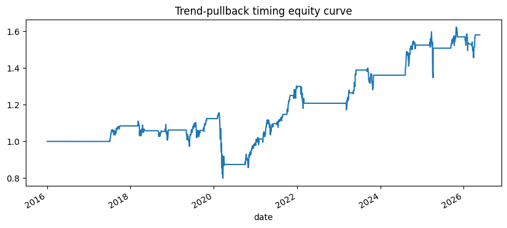

<!-- Generated by scripts/generate_column_notebook_pages.py; do not edit manually. -->
# Single-Asset Timing with Trend Pullbacks and vectorbt

<div class="gallery-note notebook-transcript-note">
  <strong>Rendered notebook transcript.</strong> This page is generated from <a href="https://github.com/systems-mechanobiology/De-Time/blob/main/examples/notebooks/quant_trading/02_single_asset_timing_vectorbt.ipynb"><code>examples/notebooks/quant_trading/02_single_asset_timing_vectorbt.ipynb</code></a> and includes code cells plus captured outputs from the committed notebook.
</div>

This notebook builds a single-asset timing signal: trade long when the trend is positive and the residual is temporarily cheap. It runs through a transparent pandas backtest first and then shows how to route the same signal to vectorbt.

<div class="notebook-cell">
<div class="notebook-input-label">In [1]</div>

```python
from pathlib import Path
import sys

ROOT = Path.cwd()
while ROOT != ROOT.parent and not (ROOT / "pyproject.toml").exists():
    ROOT = ROOT.parent
for path in [ROOT / "src", ROOT / "examples"]:
    if str(path) not in sys.path:
        sys.path.insert(0, str(path))

import matplotlib.pyplot as plt
import numpy as np
import pandas as pd

from quant_trading.data import fetch_yahoo_prices, fetch_yahoo_ohlcv, data_audit_report, DEFAULT_UNIVERSES
from quant_trading.features import decompose_one_series, walkforward_decompose, build_feature_table
from quant_trading.signals import (
    trend_pullback_signals,
    residual_mean_reversion_signals,
    turtle_donchian_signals,
    pair_trading_weights,
    cross_sectional_rotation_weights,
    residual_stress_filter,
)
from quant_trading.backtest import backtest_weights, backtest_long_short_signals, summarize_returns
```
</div>

<div class="notebook-cell">
<div class="notebook-input-label">In [2]</div>

```python
prices = fetch_yahoo_prices(["SPY", "QQQ"], start="2016-01-01", cache_dir=ROOT / "examples" / "quant_trading" / "data" / "cache")
features = walkforward_decompose(prices, method="STL", period=63, train_window=252, step=21)
entries, exits = trend_pullback_signals(prices, features, residual_entry_z=-1.0, residual_exit_z=0.25)
result = backtest_long_short_signals(prices, entries, exits, fee_bps=1.0, slippage_bps=2.0)
result.stats_frame()
```

<div class="gallery-out notebook-output">
<div class="notebook-output-label">text/html</div>
<div class="notebook-html-output">
<div>
<style scoped>
    .dataframe tbody tr th:only-of-type {
        vertical-align: middle;
    }

    .dataframe tbody tr th {
        vertical-align: top;
    }

    .dataframe thead th {
        text-align: right;
    }
</style>
<table border="1" class="dataframe">
  <thead>
    <tr style="text-align: right;">
      <th></th>
      <th>value</th>
    </tr>
  </thead>
  <tbody>
    <tr>
      <th>total_return</th>
      <td>0.579944</td>
    </tr>
    <tr>
      <th>cagr</th>
      <td>0.045116</td>
    </tr>
    <tr>
      <th>volatility</th>
      <td>0.130780</td>
    </tr>
    <tr>
      <th>sharpe</th>
      <td>0.402986</td>
    </tr>
    <tr>
      <th>max_drawdown</th>
      <td>-0.308406</td>
    </tr>
    <tr>
      <th>calmar</th>
      <td>0.146288</td>
    </tr>
    <tr>
      <th>hit_rate</th>
      <td>0.173047</td>
    </tr>
    <tr>
      <th>average_turnover</th>
      <td>0.019142</td>
    </tr>
    <tr>
      <th>average_gross_exposure</th>
      <td>0.305513</td>
    </tr>
    <tr>
      <th>fee_bps</th>
      <td>1.000000</td>
    </tr>
    <tr>
      <th>slippage_bps</th>
      <td>2.000000</td>
    </tr>
    <tr>
      <th>periods_per_year</th>
      <td>252.000000</td>
    </tr>
  </tbody>
</table>
</div>
</div>
</div>
</div>

<div class="notebook-cell">
<div class="notebook-input-label">In [3]</div>

```python
ax = result.equity.plot(figsize=(10, 4), title="Trend-pullback timing equity curve")
ax.set_xlabel("date")
plt.show()
```

<div class="gallery-out notebook-output">
<div class="notebook-output-label">image/png</div>

</div>
</div>

## Optional: vectorbt adapter

Install vectorbt first if needed. The same entry/exit matrices can be passed to `Portfolio.from_signals` through the adapter.

<div class="notebook-cell">
<div class="notebook-input-label">In [4]</div>

```python
from quant_trading.frameworks import run_vectorbt_from_signals

# portfolio = run_vectorbt_from_signals(prices, entries, exits, fees=0.0001, slippage=0.0002)
# portfolio.stats()
```
</div>
