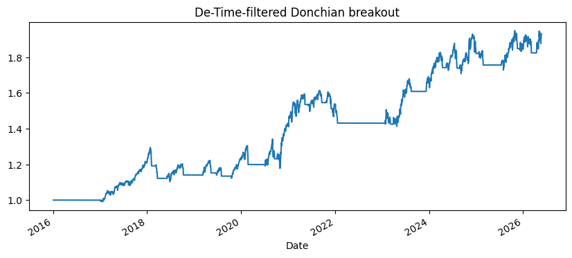

<!-- Generated by scripts/generate_column_notebook_pages.py; do not edit manually. -->
# Turtle / Donchian Breakout with a De-Time Trend Filter

<div class="gallery-note notebook-transcript-note">
  <strong>Rendered notebook transcript.</strong> This page is generated from <a href="https://github.com/systems-mechanobiology/De-Time/blob/main/examples/notebooks/quant_trading/03_turtle_donchian_trend_filter.ipynb"><code>examples/notebooks/quant_trading/03_turtle_donchian_trend_filter.ipynb</code></a> and includes code cells plus captured outputs from the committed notebook.
</div>

Classical Turtle-style breakout systems enter when price breaks above a prior high and exit on a lower-channel break. De-Time adds a trend confirmation layer so the breakout must agree with the decomposed trend.

<div class="notebook-cell">
<div class="notebook-input-label">In [1]</div>

```python
from pathlib import Path
import sys

ROOT = Path.cwd()
while ROOT != ROOT.parent and not (ROOT / "pyproject.toml").exists():
    ROOT = ROOT.parent
for path in [ROOT / "src", ROOT / "examples"]:
    if str(path) not in sys.path:
        sys.path.insert(0, str(path))

import matplotlib.pyplot as plt
import numpy as np
import pandas as pd

from quant_trading.data import fetch_yahoo_prices, fetch_yahoo_ohlcv, data_audit_report, DEFAULT_UNIVERSES
from quant_trading.features import decompose_one_series, walkforward_decompose, build_feature_table
from quant_trading.signals import (
    trend_pullback_signals,
    residual_mean_reversion_signals,
    turtle_donchian_signals,
    pair_trading_weights,
    cross_sectional_rotation_weights,
    residual_stress_filter,
)
from quant_trading.backtest import backtest_weights, backtest_long_short_signals, summarize_returns
```
</div>

<div class="notebook-cell">
<div class="notebook-input-label">In [2]</div>

```python
prices = fetch_yahoo_prices(["SPY", "QQQ", "IWM", "DIA"], start="2016-01-01", cache_dir=ROOT / "examples" / "quant_trading" / "data" / "cache")
features = walkforward_decompose(prices, method="STL", period=63, train_window=252, step=21)
entries, exits = turtle_donchian_signals(prices, features, entry_window=55, exit_window=20, use_trend_filter=True)
result = backtest_long_short_signals(prices, entries, exits, fee_bps=1.0, slippage_bps=2.0)
result.stats_frame()
```

<div class="gallery-out notebook-output">
<div class="notebook-output-label">text/html</div>
<div class="notebook-html-output">
<div>
<style scoped>
    .dataframe tbody tr th:only-of-type {
        vertical-align: middle;
    }

    .dataframe tbody tr th {
        vertical-align: top;
    }

    .dataframe thead th {
        text-align: right;
    }
</style>
<table border="1" class="dataframe">
  <thead>
    <tr style="text-align: right;">
      <th></th>
      <th>value</th>
    </tr>
  </thead>
  <tbody>
    <tr>
      <th>total_return</th>
      <td>0.932556</td>
    </tr>
    <tr>
      <th>cagr</th>
      <td>0.065627</td>
    </tr>
    <tr>
      <th>volatility</th>
      <td>0.097210</td>
    </tr>
    <tr>
      <th>sharpe</th>
      <td>0.702664</td>
    </tr>
    <tr>
      <th>max_drawdown</th>
      <td>-0.147851</td>
    </tr>
    <tr>
      <th>calmar</th>
      <td>0.443876</td>
    </tr>
    <tr>
      <th>hit_rate</th>
      <td>0.307044</td>
    </tr>
    <tr>
      <th>average_turnover</th>
      <td>0.046899</td>
    </tr>
    <tr>
      <th>average_gross_exposure</th>
      <td>0.545942</td>
    </tr>
    <tr>
      <th>fee_bps</th>
      <td>1.000000</td>
    </tr>
    <tr>
      <th>slippage_bps</th>
      <td>2.000000</td>
    </tr>
    <tr>
      <th>periods_per_year</th>
      <td>252.000000</td>
    </tr>
  </tbody>
</table>
</div>
</div>
</div>
</div>

<div class="notebook-cell">
<div class="notebook-input-label">In [3]</div>

```python
pd.DataFrame({
    "entries_per_asset": entries.sum(),
    "exits_per_asset": exits.sum(),
})
```

<div class="gallery-out notebook-output">
<div class="notebook-output-label">text/html</div>
<div class="notebook-html-output">
<div>
<style scoped>
    .dataframe tbody tr th:only-of-type {
        vertical-align: middle;
    }

    .dataframe tbody tr th {
        vertical-align: top;
    }

    .dataframe thead th {
        text-align: right;
    }
</style>
<table border="1" class="dataframe">
  <thead>
    <tr style="text-align: right;">
      <th></th>
      <th>entries_per_asset</th>
      <th>exits_per_asset</th>
    </tr>
    <tr>
      <th>Ticker</th>
      <th></th>
      <th></th>
    </tr>
  </thead>
  <tbody>
    <tr>
      <th>SPY</th>
      <td>390</td>
      <td>180</td>
    </tr>
    <tr>
      <th>QQQ</th>
      <td>370</td>
      <td>185</td>
    </tr>
    <tr>
      <th>IWM</th>
      <td>176</td>
      <td>212</td>
    </tr>
    <tr>
      <th>DIA</th>
      <td>298</td>
      <td>180</td>
    </tr>
  </tbody>
</table>
</div>
</div>
</div>
</div>

<div class="notebook-cell">
<div class="notebook-input-label">In [4]</div>

```python
result.equity.plot(figsize=(10, 4), title="De-Time-filtered Donchian breakout")
plt.show()
```

<div class="gallery-out notebook-output">
<div class="notebook-output-label">image/png</div>

</div>
</div>
