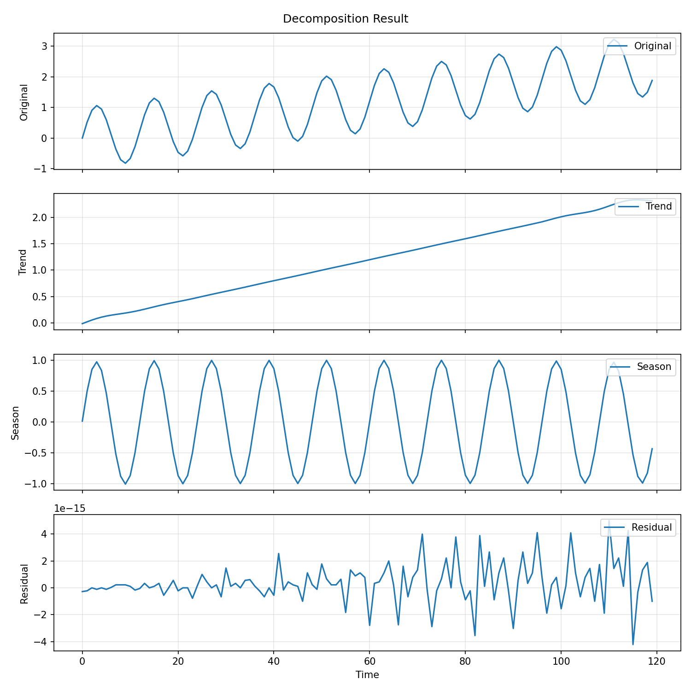
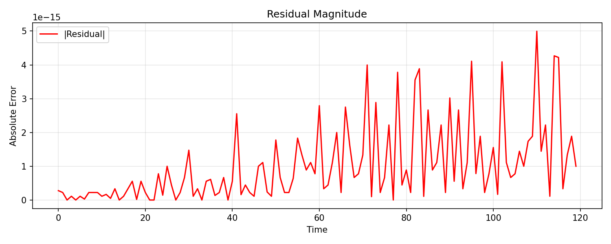

# Univariate workflows

## When to use univariate methods

Use the univariate path when one observed series is decomposed into trend,
seasonality, and remainder components.

Good starting methods:

- `STL` when the seasonal period is known and the data are reasonably regular,
- `SSA` when you want a flexible subspace method,
- `STD` when you want blockwise seasonal-trend-dispersion structure,
- `WAVELET` when you want a multi-scale signal-processing view.

## Python example: SSA

```python
import numpy as np
from detime import DecompositionConfig, decompose

t = np.arange(120, dtype=float)
series = 0.02 * t + np.sin(2.0 * np.pi * t / 12.0)

result = decompose(
    series,
    DecompositionConfig(
        method="SSA",
        params={"window": 24, "rank": 6, "primary_period": 12},
    ),
)
```

Observed output from `examples/univariate_quickstart.py` on the current docs
build:

```text
trend shape: (120,)
season shape: (120,)
residual shape: (120,)
backend: native
```

Published raw stdout:

- [python_example_stdout.txt](../assets/generated/tutorials/univariate/python_example_stdout.txt)

## Published method snapshot on the repo sample series

The current docs build also records a direct `SSA` versus `STD` snapshot on
`examples/data/example_series.csv`.

| Method | Backend | Trend std | Seasonal std | Residual RMS | Peak residual | Reconstruction error |
|---|---|---:|---:|---:|---:|---:|
| `SSA` | `native` | 0.6917 | 0.7036 | 0.0000 | 0.0000 | 0.0000 |
| `STD` | `native` | 0.6893 | 0.6558 | 0.0000 | 0.0000 | 0.0000 |

Published experiment record:

- [method_snapshot.csv](../assets/generated/tutorials/univariate/method_snapshot.csv)
- [method_snapshot.json](../assets/generated/tutorials/univariate/method_snapshot.json)

This sample series is intentionally smooth and periodic, so both methods
reconstruct it almost perfectly. Use the visual walkthroughs below when you
want a noisier signal that leaves a visible residual.

## Saving output with the CLI

```bash
python -m detime run \
  --method SSA \
  --series examples/data/example_series.csv \
  --col value \
  --param window=24 \
  --param rank=6 \
  --param primary_period=12 \
  --out_dir out/ssa_run \
  --output-mode summary \
  --plot
```

Published CLI stdout from the current docs build:

```text
Running SSA on examples/data/example_series.csv...
Done. Results saved to out/ssa_run
```

Published output files:

- [example_series_summary.json](../assets/generated/tutorials/cli-and-profiling/single-file/example_series_summary.json)
- [example_series_plot.png](../assets/generated/tutorials/cli-and-profiling/single-file/example_series_plot.png)
- [example_series_error.png](../assets/generated/tutorials/cli-and-profiling/single-file/example_series_error.png)
- [command_stdout.txt](../assets/generated/tutorials/cli-and-profiling/single-file/command_stdout.txt)

Published example outputs:





## Where to go next

- Use [Visual Univariate Walkthrough](visual-univariate.md) when you want one
  noisier signal with clearer residual structure.
- Use [Visual Method Comparison](visual-comparison.md) when you want to compare
  `SSA`, `STD`, `STDR`, and `STL` on the same series before choosing a
  default.
