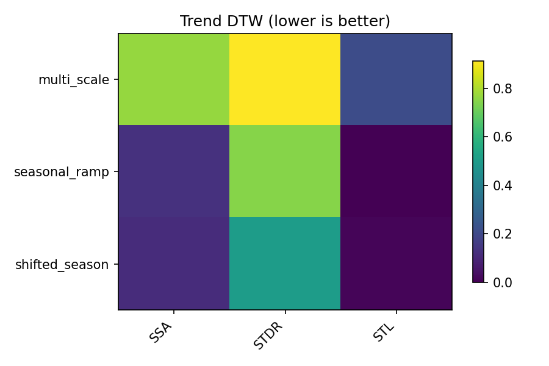
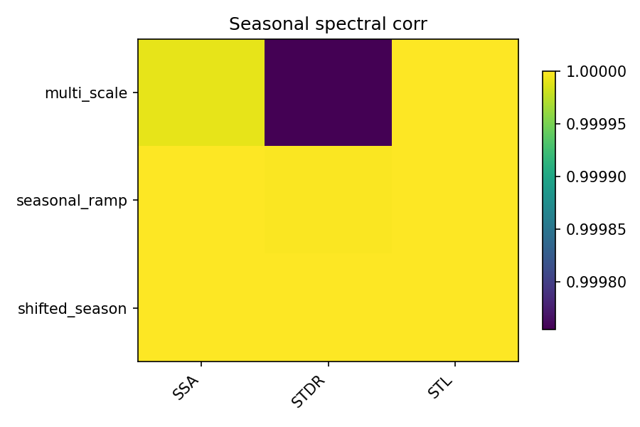
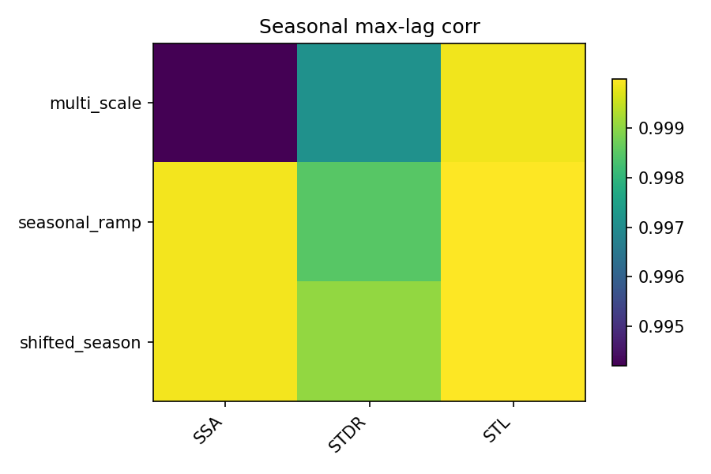

# Visual tutorial: lightweight leaderboard heatmaps

This tutorial turns a small local experiment into the kind of visual summary
that is easy to scan in a methods note or project README.

## Goal

Run a tiny scenario sweep and produce heatmaps for:

- trend `R2`,
- trend `DTW`,
- seasonal spectral correlation,
- seasonal max-lag correlation.

## Script

Run:

```bash
PYTHONPATH=src python3 examples/visual_leaderboard_walkthrough.py \
  --out-dir out/visual_leaderboard
```

This is intentionally lightweight. It does **not** run the full benchmark
artifact pipeline. Instead, it:

- builds three synthetic scenarios with known trend and season components,
- runs a small set of stable methods,
- computes the same style of summary metrics used by the leaderboard heatmap
  helper,
- writes one summary CSV and several PNG heatmaps.

## Output files

- `out/visual_leaderboard/summary/mini_leaderboard_by_scenario.csv`
- `out/visual_leaderboard/figures/heatmap_T_r2.png`
- `out/visual_leaderboard/figures/heatmap_T_dtw.png`
- `out/visual_leaderboard/figures/heatmap_S_spectral.png`
- `out/visual_leaderboard/figures/heatmap_S_maxlag.png`

Published example outputs:

Trend `R2` heatmap:


Trend `DTW` heatmap:



Seasonal spectral correlation heatmap:



Seasonal max-lag correlation heatmap:



## How to read the figures

Trend `R2` heatmap:

- good for seeing which methods track large-scale drift cleanly,
- higher is better.

Trend `DTW` heatmap:

- useful when shape alignment matters more than pointwise exactness,
- lower is better.

Seasonal spectral heatmap:

- shows whether the recovered seasonal component keeps the right frequency
  content,
- especially useful when methods recover the right amplitude but wrong rhythm.

Seasonal max-lag heatmap:

- highlights phase agreement,
- useful when one method shifts the season pattern in time.

## Why this page exists

The full benchmark stack is heavier and more research-artifact flavored. This
mini leaderboard tutorial gives you a public-facing, reproducible visual
summary that still comes from real local runs.
