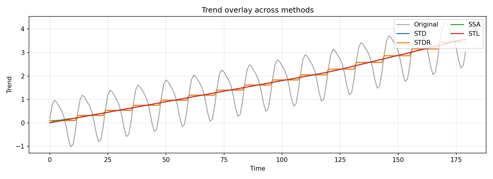
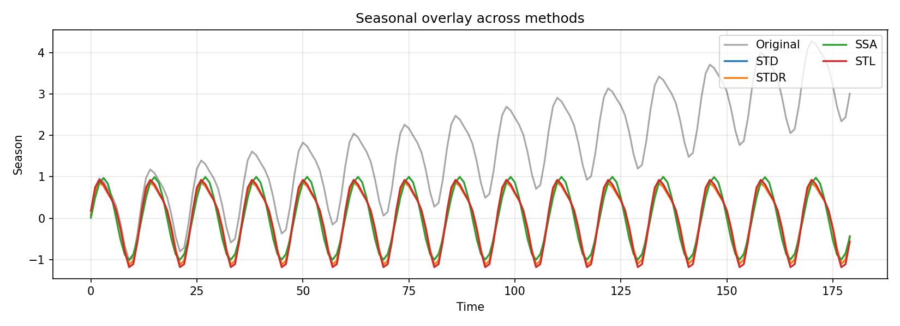

# Visual tutorial: compare methods on the same series

This tutorial is for the question: "which decomposition is behaving
qualitatively better on this signal?"

## Goal

Run several methods on the same series and compare:

- their full decomposition panels,
- their trend estimates,
- their seasonal estimates.

## Script

Run:

```bash
PYTHONPATH=src python3 examples/visual_method_comparison.py \
  --out-dir out/visual_method_comparison
```

This script compares:

- `STD`
- `STDR`
- `SSA`
- `STL`

## Output files

The script writes:

- `out/visual_method_comparison/method_grid.png`
- `out/visual_method_comparison/trend_overlay.png`
- `out/visual_method_comparison/season_overlay.png`
- `out/visual_method_comparison/comparison_summary.csv`

Published experiment record:

- [comparison_summary.csv](../assets/generated/tutorials/visual-comparison/comparison_summary.csv)

Published summary from the current docs build:

| Method | Backend | Trend std | Seasonal std | Residual RMS | Reconstruction error |
|---|---|---:|---:|---:|---:|
| `STD` | `native` | 1.0123 | 0.6723 | 0.0000 | 0.0000 |
| `STDR` | `native` | 1.0123 | 0.6723 | 0.0056 | 0.0000 |
| `SSA` | `native` | 1.0129 | 0.7052 | 0.1766 | 0.0000 |
| `STL` | `python` | 1.0149 | 0.7289 | 0.0012 | 0.0000 |

Published example outputs:






## How to read the figures

These values come from one actual local run of the published script. The table
is useful because it keeps the figure interpretation grounded in recorded
numbers rather than only visual preference.

`method_grid.png` is the broadest comparison:

- each row is one method,
- columns show original, trend, season, and residual,
- use it to see where one method is over-smoothing or leaking seasonality into
  the trend.

`trend_overlay.png` is the fastest high-level diagnostic:

- if one method has a much more jagged trend than the others, it is probably
  retaining seasonal energy in the trend,
- if one method is too flat, it may be over-suppressing meaningful drift.

`season_overlay.png` helps you judge:

- amplitude consistency,
- phase alignment,
- whether a method is inventing oscillation where the others agree there is
  little structure.

## Suggested experimental pattern

Use this workflow when choosing defaults:

1. Start with 3 to 4 methods, not 10.
2. Inspect trend overlay first.
3. Inspect residual structure next.
4. Only then decide which method deserves benchmarking on a larger sweep.

This prevents spending hours benchmarking methods that already look wrong by
inspection.
