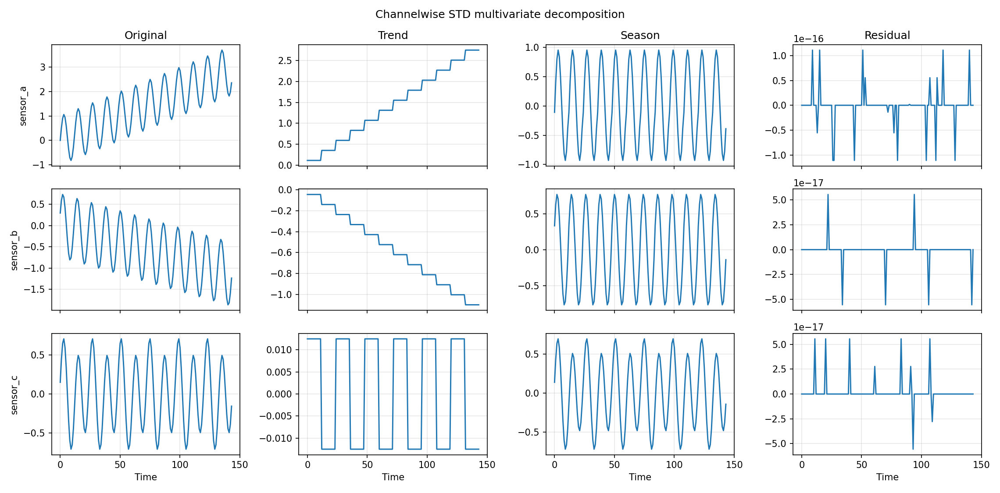
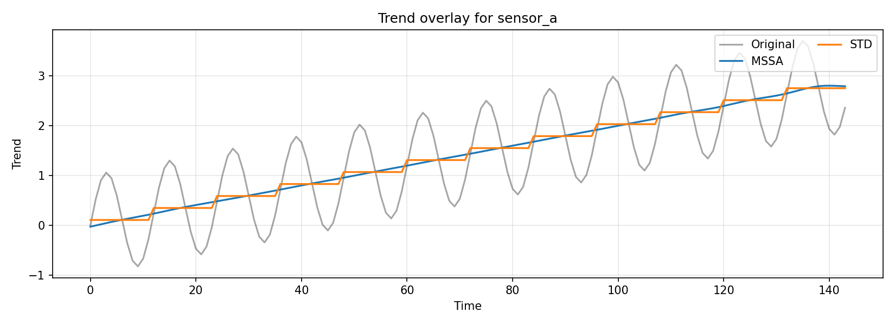

# Visual tutorial: multivariate decomposition

Multivariate decomposition is easiest to understand when you can see channels
side by side.

## Goal

Compare:

- a true joint multivariate method (`MSSA`),
- a channelwise baseline (`STD` run independently on each channel).

## Script

Run:

```bash
PYTHONPATH=src python3 examples/visual_multivariate_walkthrough.py \
  --out-dir out/visual_multivariate
```

The script builds a three-channel synthetic panel with related but not identical
seasonal structure.

## Output files

The script writes:

- `out/visual_multivariate/mssa_multivariate.png`
- `out/visual_multivariate/std_channelwise_multivariate.png`
- `out/visual_multivariate/channel0_trend_overlay.png`
- `out/visual_multivariate/multivariate_summary.csv`

Published experiment record:

- [multivariate_summary.csv](../assets/generated/tutorials/visual-multivariate/multivariate_summary.csv)

Published summary from the current docs build:

| Channel | MSSA backend | STD backend | MSSA residual RMS | STD residual RMS | Mean abs trend gap |
|---|---|---|---:|---:|---:|
| `sensor_a` | `python` | `native` | 0.0047 | 0.0000 | 0.0590 |
| `sensor_b` | `python` | `native` | 0.0038 | 0.0000 | 0.0260 |
| `sensor_c` | `python` | `native` | 0.0999 | 0.0000 | 0.0128 |

Published example outputs:






## What each figure tells you

These summary values come from a real local run of the tutorial script. They
show that the multivariate and channelwise paths are not identical even when
the figures look superficially similar.

`mssa_multivariate.png`:

- look for cross-channel consistency in trend and seasonal extraction,
- useful when channels share one latent mechanism.

`std_channelwise_multivariate.png`:

- shows what happens when each channel is decomposed independently,
- useful as a baseline when you want interpretability per channel without joint
  coupling.

`channel0_trend_overlay.png`:

- isolates one channel and overlays the trend from `MSSA` and channelwise
  `STD`,
- this is the fastest way to see whether joint structure is actually changing
  the interpretation of one sensor.

## When this tutorial is useful

Use this pattern when:

- you have several sensors that probably share one seasonal driver,
- you want to justify `MSSA` instead of a simpler channelwise baseline,
- you need figures for a methods note, lab notebook, or internal review.

If the multivariate and channelwise figures are nearly identical, a joint
method may not be buying you much.
