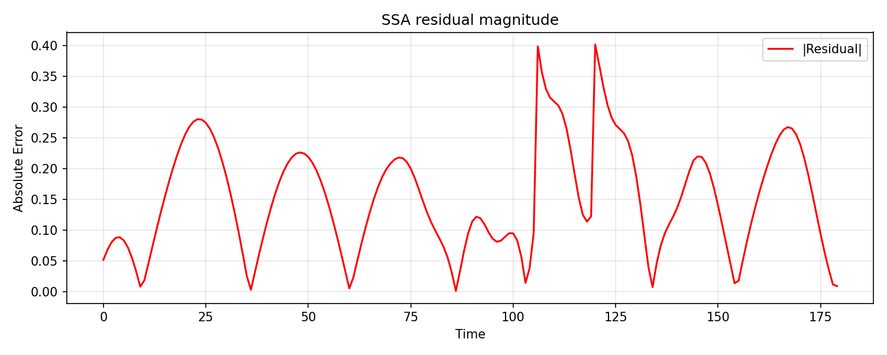

# Visual tutorial: one univariate decomposition

This walkthrough is the shortest path from a raw series to interpretable
figures.

## Goal

Use one method on one synthetic series and inspect:

- the original signal,
- the extracted trend,
- the extracted seasonal component,
- the residual magnitude.

## Script

Run:

```bash
PYTHONPATH=src python3 examples/visual_univariate_walkthrough.py \
  --out-dir out/visual_univariate
```

This script uses `SSA` on a synthetic seasonal series with drift and a short
localized pulse.

## Output files

The script writes:

- `out/visual_univariate/ssa_components.png`
- `out/visual_univariate/ssa_residual_error.png`

Published example outputs:




## What to look for

In `ssa_components.png`:

- the trend should capture the slow upward drift,
- the seasonal panel should preserve the repeating 12-step oscillation,
- the residual should mostly absorb the short pulse and small mismatches.

In `ssa_residual_error.png`:

- spikes indicate time regions where the decomposition is least comfortable,
- broad high residual regions often suggest a wrong window, wrong rank, or
  abrupt structure not well captured by the chosen method.

## How to turn this into an experiment

Change only one parameter at a time:

- increase `window` to make the trend smoother,
- reduce `rank` to force a more compressed representation,
- compare the figure before and after each change instead of only watching one
  scalar metric.

This is usually the fastest way to build intuition for `SSA`.
